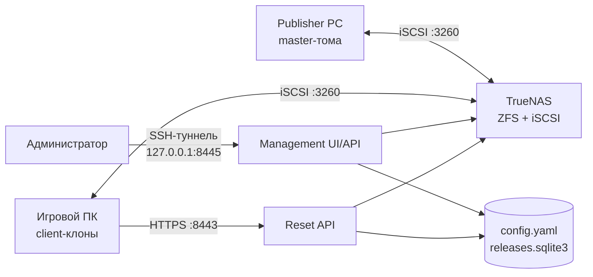

# iSCSI Reset Service v0.5.0

iSCSI Reset Service публикует согласованный набор ZFS-снимков игровых дисков и перед запуском
игрового ПК возвращает его записываемые клоны к чистому состоянию. Publisher хранит и обновляет
эталонные тома. Каждый игровой ПК получает собственные клоны и отдельную iSCSI-цель.

Целевая платформа: TrueNAS SCALE 25.10, Python 3.12+ и Windows PowerShell 5.1.

## Гарантии безопасности

Сервис работает по принципу безопасного отказа (`fail-closed`). Ответ `ready` выдаётся только
после проверки полного набора томов.

- Компьютер определяется по точным source IP, initiator IQN и target IQN.
- Windows-диски сопоставляются по NAA.
- Все extent одной операции выключаются до изменения снимков, клонов или путей.
- Активный релиз и соответствие `volume → snapshot` хранятся в SQLite.
- Частичная ошибка сохраняет прежний активный релиз, созданные снимки и выключенные extent.
- Старые релизы, снимки и клоны удаляются только вручную после проверки зависимостей.
- Клиентские подключения создаются с `IsPersistent=false`.
- Контейнеры работают от `10001:10001` с read-only root filesystem, `cap_drop: ALL` и
  `no-new-privileges`, без `privileged`, Docker socket и `/dev/zvol`.
- Storage-операции выполняются без recursive, destructive и force-флагов.

Один ПК может совмещать Publisher и игровой клиент. Для ролей используются разные targets,
а подключается только одна роль за раз.

## Архитектура



Custom App запускает два контейнера из одного digest-pinned образа:

| Контейнер | Назначение | Доступ |
|---|---|---|
| `iscsi-reset-api` | Подготовка и откат клиентских клонов | HTTPS на SAN IP `:8443`, config/state read-only |
| `iscsi-reset-management` | Настройка, наблюдение, stage и activate | HTTP `127.0.0.1:8445`, config/state read-write |

Статический `config.yaml` использует только `schema_version: 3` и описывает topology,
идентичности, extent, LUN и тома. Динамическое состояние релизов находится в
`/state/releases.sqlite3`. Ключи `publisher.volumes` произвольны; клиент может использовать
подмножество томов Publisher. Master zvol и его client clone parent располагаются в одном
ZFS-пуле.

## Что подготовить

| Назначение | Пример |
|---|---|
| SAN | `10.20.40.0/24` |
| iSCSI portal и Reset API | `10.20.40.10` |
| Publisher | `10.20.40.100` |
| Игровой ПК | `10.20.40.101` |
| Management IP TrueNAS | `192.168.3.218` |
| Служебный пул | `tank` |

Также потребуются:

- отдельная SAN для iSCSI;
- один Publisher и хотя бы один игровой ПК;
- OpenSSL 3.x на доверенном компьютере для собственной PKI;
- точные dataset, target, extent ID, LUN, NAA, serial, IP, IQN, drive letter и label для
  каждого тома.

Target, token digest и extent ID должны быть глобально уникальны. LUN уникален внутри target,
буква — внутри клиента. Ровно один dual-role клиент может повторять полную пару Publisher
`source_ip + initiator_iqn`; его target остаётся отдельным. IQN Windows показывает команда
`Get-InitiatorPort`.

## Подготовка TrueNAS

### Служебные datasets

Создайте parent `tank/iscsi-reset` и четыре дочерних Filesystem dataset с preset `Generic`:

```text
tank/iscsi-reset/config   → /mnt/tank/iscsi-reset/config
tank/iscsi-reset/state    → /mnt/tank/iscsi-reset/state
tank/iscsi-reset/secrets  → /mnt/tank/iscsi-reset/secrets
tank/iscsi-reset/tls      → /mnt/tank/iscsi-reset/tls
```

Оставьте datasets без SMB/NFS shares, разблокируйте encrypted datasets до запуска и включите
`config` и `state` в резервное копирование. Назначьте владельца контейнеров:

```bash
sudo chown 10001:10001 /mnt/tank/iscsi-reset/config \
  /mnt/tank/iscsi-reset/state \
  /mnt/tank/iscsi-reset/secrets \
  /mnt/tank/iscsi-reset/tls
sudo chmod 0700 /mnt/tank/iscsi-reset/config \
  /mnt/tank/iscsi-reset/state \
  /mnt/tank/iscsi-reset/secrets \
  /mnt/tank/iscsi-reset/tls
```

Первый запуск ожидает отсутствующие `config.yaml` и `releases.sqlite3`. Приложение создаст их
после сохранения валидной конфигурации.

### Master zvol и clone parents

Для каждого логического тома подготовьте:

1. Master zvol нужного размера.
2. Пустой Filesystem dataset для клонов каждого клиента в том же ZFS-пуле.
3. Начальный `__bootstrap` zvol нужного размера внутри clone parent для постоянной записи
   client extent.
4. Исключение `*/clients/*` из периодических задач снимков.

```text
SSDGames/MainGames                              VOLUME, master
Sas/Games-Device/Older-Games/oldergames         VOLUME, master
SSDGames/clients/chimera                        FILESYSTEM, clone parent
SSDGames/clients/chimera/ssd__bootstrap         VOLUME, bootstrap
Sas/clients/chimera                             FILESYSTEM, clone parent
Sas/clients/chimera/hdd__bootstrap              VOLUME, bootstrap
```

Для master требуется `VOLUME`, для clone parent — `FILESYSTEM`; оба объекта должны иметь
`locked: false`. Используйте Device/DISK extents. Bootstrap zvol сохраняется неформатированным
и служит только начальным путём extent.

### Portal, targets и extents

В **Shares → Block Shares (iSCSI)** создайте:

1. Portal на SAN IP, например `10.20.40.10:3260`.
2. Initiator group и target Publisher с точным IQN и `source_ip/32` в верхнеуровневом
   `target.auth_networks`.
3. Отдельный Device/DISK extent и association с фиксированным LUN для каждого master zvol.
4. Для каждого клиента отдельные initiator group, target и Device/DISK extents на bootstrap
   zvol; client target получает точный `source_ip/32`.
5. Client extents в выключенном состоянии после первоначальной проверки.

Каждый target использует собственные extent records. Сервис сохраняет ID, NAA и serial и
меняет у client extent только `disk` и `enabled`.

Проверьте Publisher target:

```bash
midclt call iscsi.target.query '[["name","=","master"]]' |
  jq '.[0] | {id, name, auth_networks, groups}'
```

Для Publisher `10.20.40.100` требуется `auth_networks: ["10.20.40.100/32"]`.

### TrueNAS API users

Создайте две локальные группы, двух пользователей с `nologin` и два privileges:

| Пользователь | Назначение | Роли |
|---|---|---|
| `iscsi-reset-service` | Storage mutations | `DATASET_READ`, `DATASET_WRITE`, `SNAPSHOT_READ`, `SNAPSHOT_WRITE`, `SHARING_ISCSI_GLOBAL_READ`, `SHARING_ISCSI_EXTENT_READ`, `SHARING_ISCSI_EXTENT_WRITE`, `SHARING_ISCSI_TARGET_READ`, `SHARING_ISCSI_TARGETEXTENT_READ` |
| `iscsi-reset-discovery` | Read-only discovery | `DATASET_READ`, `SNAPSHOT_READ`, `SHARING_ISCSI_GLOBAL_READ`, `SHARING_ISCSI_PORTAL_READ`, `SHARING_ISCSI_TARGET_READ`, `SHARING_ISCSI_EXTENT_READ`, `SHARING_ISCSI_TARGETEXTENT_READ`, `SHARING_ISCSI_INITIATOR_READ` |

Отключите SMB, sudo, password login и web shell для этих учётных записей. Сверьте роли с
[TrueNAS 25.10 RBAC](https://api.truenas.com/v25.10/rbac.html) и
[`privilege.create`](https://api.truenas.com/v25.10/api_methods_privilege.create.html), затем
подтвердите минимальный набор на своей patch-версии по [TEST-PLAN.md](TEST-PLAN.md).

Создайте API key для каждого пользователя и сохраните только значения ключей:

```text
/mnt/tank/iscsi-reset/secrets/truenas_api_key
/mnt/tank/iscsi-reset/secrets/truenas_discovery_api_key
```

```bash
sudo chown 10001:10001 /mnt/tank/iscsi-reset/secrets/truenas_api_key \
  /mnt/tank/iscsi-reset/secrets/truenas_discovery_api_key
sudo chmod 0400 /mnt/tank/iscsi-reset/secrets/truenas_api_key \
  /mnt/tank/iscsi-reset/secrets/truenas_discovery_api_key
```

### Peppers и management token

Создайте два независимых pepper:

```bash
umask 077
openssl rand -hex 32 | sudo tee \
  /mnt/tank/iscsi-reset/secrets/token_pepper >/dev/null
openssl rand -hex 32 | sudo tee \
  /mnt/tank/iscsi-reset/secrets/management_token_pepper >/dev/null
sudo chown 10001:10001 /mnt/tank/iscsi-reset/secrets/token_pepper \
  /mnt/tank/iscsi-reset/secrets/management_token_pepper
sudo chmod 0400 /mnt/tank/iscsi-reset/secrets/token_pepper \
  /mnt/tank/iscsi-reset/secrets/management_token_pepper
```

Сгенерируйте management token опубликованным digest-pinned образом:

```bash
docker run --rm --network none --read-only --user 10001:10001 \
  --cap-drop ALL --security-opt no-new-privileges \
  -v /mnt/tank/iscsi-reset/secrets/management_token_pepper:/run/secrets/management_token_pepper:ro \
  IMAGE_AT_IMMUTABLE_DIGEST \
  management-token generate --pepper-file /run/secrets/management_token_pepper
```

Сохраните исходный токен в менеджере паролей, а выведенный `hmac-sha256:...` — в
`/mnt/tank/iscsi-reset/secrets/management_token_digest`:

```bash
sudo chown 10001:10001 /mnt/tank/iscsi-reset/secrets/management_token_digest
sudo chmod 0400 /mnt/tank/iscsi-reset/secrets/management_token_digest
```

Raw tokens, peppers, API keys, PFX passwords и private keys хранятся только в предназначенных
защищённых файлах и менеджере паролей.

### PKI Reset API

Создайте CA и серверный сертификат на доверенном компьютере с OpenSSL 3.x. Укажите SAN IP,
используемый игровыми клиентами:

```bash
umask 077
mkdir iscsi-reset-pki
cd iscsi-reset-pki
RESET_IP=10.20.40.10

openssl genpkey -algorithm RSA -pkeyopt rsa_keygen_bits:3072 \
  -aes-256-cbc -out reset-ca.key
openssl req -x509 -new -sha256 -days 3650 \
  -key reset-ca.key -out reset-ca.crt \
  -subj "/CN=iSCSI Reset CA" \
  -addext "basicConstraints=critical,CA:TRUE,pathlen:0" \
  -addext "keyUsage=critical,keyCertSign,cRLSign"

openssl genpkey -algorithm RSA -pkeyopt rsa_keygen_bits:3072 \
  -out reset-server.key
openssl req -new -sha256 \
  -key reset-server.key -out reset-server.csr \
  -subj "/CN=iscsi-reset-api" \
  -addext "basicConstraints=critical,CA:FALSE" \
  -addext "keyUsage=critical,digitalSignature,keyEncipherment" \
  -addext "extendedKeyUsage=serverAuth" \
  -addext "subjectAltName=IP:${RESET_IP}"
openssl x509 -req -sha256 -days 825 \
  -in reset-server.csr \
  -CA reset-ca.crt -CAkey reset-ca.key -CAcreateserial \
  -copy_extensions copy -out reset-server.crt
```

Проверьте сертификат:

```bash
openssl verify -CAfile reset-ca.crt -purpose sslserver reset-server.crt
openssl x509 -in reset-server.crt -noout -checkip "$RESET_IP"
```

Разместите серверные файлы на TrueNAS:

```text
/mnt/tank/iscsi-reset/tls/reset-server.crt
/mnt/tank/iscsi-reset/tls/reset-server.key
```

```bash
sudo chown 10001:10001 /mnt/tank/iscsi-reset/tls/reset-server.crt \
  /mnt/tank/iscsi-reset/tls/reset-server.key
sudo chmod 0400 /mnt/tank/iscsi-reset/tls/reset-server.crt \
  /mnt/tank/iscsi-reset/tls/reset-server.key
```

Передайте игровым ПК только `reset-ca.crt`. CA private key остаётся на доверенном компьютере.

## Установка Custom App

GitHub Release содержит семь файлов:

| Файл | Назначение |
|---|---|
| `iscsi-reset-service-vX.Y.Z-truenas.yaml` | Custom App с digest-pinned образом |
| `image-digest.txt` | Полная ссылка на образ |
| `SHA256SUMS` | Контрольные суммы остальных шести файлов |
| `Install-IscsiReleasePublisher.ps1` | Установщик Publisher helper |
| `Publish-IscsiRelease.ps1` | Disconnect/Reconnect Publisher |
| `Install-IscsiResetClient.ps1` | Установщик клиента |
| `Reset-And-Connect.ps1` | Reset и подключение клиента |

`publisher.json` скачивается из Management UI после сохранения конфигурации.

Скачайте все семь файлов в один каталог и проверьте их:

```bash
sha256sum --check SHA256SUMS
```

На macOS:

```bash
shasum -a 256 -c SHA256SUMS
```

Подготовьте YAML:

1. Замените пути `/mnt/tank/...` на пути своей системы.
2. Замените оба `REPLACE_WITH_TRUENAS_MANAGEMENT_IP` на management IP TrueNAS.
3. Установите `BIND_HOST` равным SAN IP Reset API и проверьте SAN сертификата.
4. Выполните:

   ```bash
   docker compose -f iscsi-reset-service-vX.Y.Z-truenas.yaml config --quiet
   ```

5. Откройте **Apps → Discover Apps → Custom App**, выберите YAML и установите приложение.
6. Проверьте запуск двух контейнеров и доступность Management UI только через loopback.

Для временного отключения TLS verification между App и TrueNAS установите одновременно
`TRUENAS_TLS_VERIFY=false` и `TRUENAS_TLS_INSECURE_ACK=I_ACCEPT_MITM_RISK`.

## Настройка через Management UI

Включите **Allow TCP Port Forwarding** у SSH-сервиса TrueNAS и откройте туннель:

```bash
ssh -N -L 8445:127.0.0.1:8445 <user>@<truenas-management-ip>
```

Проверьте endpoint и откройте `http://127.0.0.1:8445`:

```bash
curl http://127.0.0.1:8445/healthz
```

Войдите исходным management token. Сессия использует `HttpOnly`/`SameSite=Strict` cookie,
idle timeout 30 минут и абсолютный timeout 8 часов.

Полный пример схемы находится в
[`config/config.example.yaml`](config/config.example.yaml). В интерфейсе:

1. Заполните SAN, portal, release prefix и timezone.
2. Выберите Publisher target, IQN и master volumes.
3. Добавьте клиентов с точными IP, IQN, target, томами, буквами и labels.
4. Сгенерируйте client token и сразу сохраните показанное значение; YAML получает только HMAC
   digest.
5. Выполните validation и сохраните конфигурацию.
6. Сравните `saved revision` и `startup revision`, затем перезапустите весь Custom App.

Для dual-role ПК задайте клиенту IP/IQN Publisher и отдельную client target.

До первой активации Reset API `/readyz` возвращает `503`.

## Установка Publisher

Скачайте `Install-IscsiReleasePublisher.ps1`, `Publish-IscsiRelease.ps1` и актуальный
`publisher.json`. Запустите установщик в повышенной Windows PowerShell 5.1 под интерактивным
пользователем, который на Publisher настраивает игровые launcher:

```powershell
Set-ExecutionPolicy -Scope Process Bypass
./Install-IscsiReleasePublisher.ps1 `
  -ManifestSourcePath ./publisher.json `
  -EpicGamesManifestSync Aggressive `
  -MajesticLauncherSettingsSync Enabled
```

Установщик размещает helper и защищённую конфигурацию в
`C:\ProgramData\IscsiResetPublisher`. После изменения общей конфигурации скачайте новый
`publisher.json` и повторите установку до следующего `Disconnect`.

## Установка клиента

Скачайте `Install-IscsiResetClient.ps1`, `Reset-And-Connect.ps1` и `reset-ca.crt`. Запустите
установщик в повышенной Windows PowerShell 5.1 под игровой учётной записью:

```powershell
Set-ExecutionPolicy -Scope Process Bypass
./Install-IscsiResetClient.ps1 `
  -CaCertificatePath ./reset-ca.crt `
  -ResetApiIp 10.20.40.10 `
  -EpicGamesManifestSync Aggressive `
  -MajesticLauncherSettingsSync Enabled
```

Введите client token в скрытом приглашении. Установщик сохраняет token, сертификат,
конфигурацию, SID и профиль игрового пользователя в `C:\ProgramData\IscsiReset`, закрывает ACL
для SYSTEM и Administrators и создаёт startup-задачу под `SYSTEM`.

## Режимы launcher sync

Установите одинаковые режимы на Publisher и соответствующих клиентах.

| Параметр | Режим | Результат |
|---|---|---|
| `-EpicGamesManifestSync` | `Disabled` | Синхронизация Epic выключена |
| `-EpicGamesManifestSync` | `Enabled` | Перенос регистрации сетевых игр; одинаковые буквы и полные пути обязательны |
| `-EpicGamesManifestSync` | `Aggressive` | Полное состояние Epic для клиента с точным полным набором Publisher-томов |
| `-MajesticLauncherSettingsSync` | `Disabled` | Синхронизация Majestic выключена |
| `-MajesticLauncherSettingsSync` | `Enabled` | Перенос настроек и состояния проверки Majestic |

Оба параметра по умолчанию имеют значение `Disabled`. Majestic включается отдельно от Epic.

### Epic Games Launcher

`Enabled` переносит launcher state сетевых игр, чтобы Epic видел соответствующие файлы на тех
же буквах и полных путях. `Aggressive` дополнительно переносит общее состояние Epic и требует
точный полный case-sensitive набор логических Publisher-томов. Для сетевых игр отключите Auto
Update штатным переключателем Epic Games Launcher.

Синхронизация сохраняет локальные учётные записи, authorization, LocalAppData, webcache и
несвязанные установки. На старом release может отображаться `Update`; при совпадающем build
ожидается `Launch` без полной загрузки.

### Majestic Launcher

`Enabled` переносит настройки, выбранный сервер, пути, имя игрока и состояние проверки из:

- `%APPDATA%\majestic-launcher\prefs.latest.json`;
- `%APPDATA%\majestic-launcher\Multiplayer\majestic.json`;
- `%APPDATA%\majestic-launcher\hashMap_v3.json`;
- `%APPDATA%\majestic-launcher\hashMap_v3_RO.json`;
- `%APPDATA%\majestic-launcher\Multiplayer\backupMap.json`;
- `HKCU\Software\MAJESTIC-LAUNCHER` — `lastVisitedServerID` и `game_disk`.

При первом Publisher `Disconnect` каталог `Multiplayer\backup` переносится на том из
`prefs.latest.json.gameDisk` в `<gameDisk>\.iscsi-reset\majestic-launcher-backup`, а профильный
каталог заменяется постоянным directory junction. Следующие публикации используют этот каталог
на master-томе и переносят только небольшие файлы и реестр, поэтому backup размером 2.5–3 GiB
повторно не копируется.

Клиенты используют ту же букву `gameDisk`; helper создаёт профильный junction на payload своего
клона. Переносятся только перечисленные настройки и verification state. Авторизация,
`mods.bin`, Chromium Cache, Local Storage и Session Storage остаются локальными.

## Ежедневная эксплуатация

### Выпуск релиза

1. Обновите master-тома Publisher и завершите записи.
2. Выполните:

   ```powershell
   C:\ProgramData\IscsiResetPublisher\Publish-IscsiRelease.ps1 -Action Disconnect
   ```

3. В Management UI убедитесь, что Publisher имеет состояние `disconnected`.
4. В разделе «Релизы» нажмите «Создать релиз».
5. После состояния `staged` введите `ACTIVATE <release>` и активируйте релиз.
6. Выполните:

   ```powershell
   C:\ProgramData\IscsiResetPublisher\Publish-IscsiRelease.ps1 -Action Reconnect
   ```

Publisher helper сверяет полный набор NAA, переводит доказанные диски offline перед stage и
подключает их обратно только после activation и повторной проверки.

### Dual-role ПК

Перед игровым режимом отключите master target и подтвердите исчезновение его session. Перед
режимом Publisher отключите client target и подтвердите исчезновение session. Активная другая
роль блокирует prepare, stage и activation до любых storage mutations.

### Незавершённый выпуск

Для релиза `incomplete` устраните причину и нажмите «Продолжить». Операция использует исходный
request ID и согласует уже созданные снимки. После неудачного `Reconnect` исправьте локальную
причину и повторите `Reconnect`; активный release pointer сохраняется.

### Старые релизы

Панель показывает старый релиз кандидатом для ручной очистки после перехода всех клиентов,
отсутствия `active`/`incomplete` и проверки текущих extent. Перед удалением проверьте показанные
зависимые клоны. Автоматического удаления storage objects нет.

## Диагностика

<details>
<summary><code>IdentityNotMappedException</code> в старом client installer</summary>

Создайте новый client token в панели, сохраните конфигурацию, перезапустите Custom App и
переустановите актуальный client helper под игровой учётной записью. Итоговый ACL файла
`C:\ProgramData\IscsiReset\client.token` должен содержать только `S-1-5-18` и
`S-1-5-32-544` с `FullControl`.

</details>

<details>
<summary><code>Discovery unavailable</code></summary>

Проверьте `/run/secrets/truenas_discovery_api_key`, `TRUENAS_DISCOVERY_API_USERNAME`, срок
действия API key, роли read-only пользователя и URL TrueNAS API. После исправления обновите
discovery в панели.

</details>

<details>
<summary><code>Local Epic installation is not managed by iSCSI reset</code></summary>

Переустановите актуальные Publisher и client helper, создайте новый release и повторите reset.
Существующая локальная регистрация будет сохранена в защищённой резервной копии, а сетевой
AppName станет управляемым.

</details>

<details>
<summary>После чистой установки Epic игра показывает «Продолжить»</summary>

Используйте `Aggressive` на Publisher и клиенте, выполните новый `Disconnect`, stage, activate
и client reset. Клиент должен иметь точный полный набор Publisher-томов. Проверьте наличие
событий `egs_eos_install_db_sync_ready`, `egs_programdata_sync_ready`,
`egs_manifest_sync_ready`, затем `ready`.

</details>

<details>
<summary><code>Epic Games aggressive sync requires the exact Publisher volume set</code></summary>

Подключите весь case-sensitive набор логических Publisher-томов, указанный в конфигурации.
Уберите отсутствующие, лишние, пустые, дублированные и отличающиеся регистром имена томов.

</details>

<details>
<summary><code>Epic Games aggressive target file metadata verification failed</code></summary>

Переустановите актуальный client helper и повторите reset. Текущая версия проверяет точные
bytes, размер и SHA-256, используя локальные NTFS attributes и timestamps.

</details>

<details>
<summary><code>Live state unavailable: A management dependency is unavailable</code></summary>

Проверьте SQLite, доступность TrueNAS snapshot query и роль `SNAPSHOT_READ` у
`iscsi-reset-discovery`. Management mutations возобновятся после успешной live-проверки.

</details>

<details>
<summary><code>MSFT_iSCSITarget</code> с нужным <code>NodeAddress</code> не найден</summary>

Проверьте доступность portal `10.20.40.10:3260`, точный initiator IQN и Authorized Networks.
Обновите discovery из повышенной Windows PowerShell:

```powershell
Get-IscsiTargetPortal |
  Where-Object TargetPortalAddress -eq "10.20.40.10" |
  Update-IscsiTargetPortal
Get-IscsiTarget | Select-Object NodeAddress, IsConnected
```

</details>

<details>
<summary>TrueNAS API недоступен по <code>127.0.0.1</code></summary>

Укажите management IP интерфейса TrueNAS в обоих `TRUENAS_API_URL`, например
`wss://192.168.3.218/api/current`.

</details>

<details>
<summary><code>publisher target does not authorize the exact source IP /32</code></summary>

Добавьте точный `publisher.source_ip/32` в верхнеуровневый `target.auth_networks`. Для
`10.20.40.100` требуется `10.20.40.100/32`.

</details>

<details>
<summary>Эталонный zvol отклоняется или список clone parent пуст</summary>

Проверьте тип, пул и `locked`: master должен быть `VOLUME`, clone parent — `FILESYSTEM`, оба со
значением `locked: false` и в одном пуле соответствующего тома.

</details>

<details>
<summary>Ошибки прав на <code>secrets</code>, <code>config</code> или <code>state</code></summary>

Назначьте каталогам владельца `10001:10001` и режим `0700`, а secret/TLS-файлам — владельца
`10001:10001` и режим `0400`. Сохраните копию повреждённой SQLite перед диагностикой.

</details>

<details>
<summary><code>curl 127.0.0.1:8445</code> не подключается</summary>

Включите **Allow TCP Port Forwarding**, откройте новую SSH-сессию с
`-L 8445:127.0.0.1:8445` и выполняйте `curl` на компьютере с активным туннелем.

</details>

## API и CLI

Reset API на `https://<SAN-IP>:8443`:

- `GET /healthz`, `GET /readyz`;
- `GET /v1/client`;
- `POST /v1/validate`, `POST /v1/prepare`.

Management API через SSH-туннель:

- `POST/DELETE /v1/management/session`;
- `GET /v1/management/status`, `/discovery`, `/config`, `/dashboard`, `/releases`;
- `POST /v1/management/config/validate`;
- `PUT /v1/management/config`;
- `POST /v1/management/tokens`;
- `POST /v1/management/releases/stage`;
- `POST /v1/management/releases/{release}/activate`;
- `GET /v1/management/publisher/manifest`.

CLI:

```text
serve-reset
serve-management
config validate --path /config/config.yaml
token generate <client> --config /config/config.yaml --pepper-file <path>
management-token generate --pepper-file <path>
releases validate
releases audit
releases list
```

Сервер запускается с `proxy_headers=False`. `ALLOW_TEST_SOURCE_HEADER` разрешён только для mock
backend.

## Разработка и проверка

```bash
python -m pip install -e '.[test]'
ruff check src tests
pytest -q
node --check src/iscsi_reset_service/static/app.js
node tests/static_connection_presentations.test.mjs
docker compose config --quiet
```

Полный mock interaction:

```bash
docker compose up --build --abort-on-container-exit --exit-code-from windows-simulation
docker compose down --volumes
```

Windows PowerShell 5.1:

```powershell
Invoke-Pester .\powershell\tests -Output Detailed -CI
```

Физические проверки выполняются на выделенных тестовых zvol по
[TEST-PLAN.md](TEST-PLAN.md). Фактические результаты и границы окружения записываются в
[VERIFICATION.md](VERIFICATION.md).

## Выпуск версии

Версия совпадает в `pyproject.toml` и `src/iscsi_reset_service/__init__.py`. Выпуск создаётся
аннотированным semver-тегом `vX.Y.Z`. Текст аннотации становится разделом «Что нового», а
GitHub Actions добавляет список коммитов после предыдущего semver-тега, собирает digest-pinned
образ и публикует семь файлов с `SHA256SUMS`.
