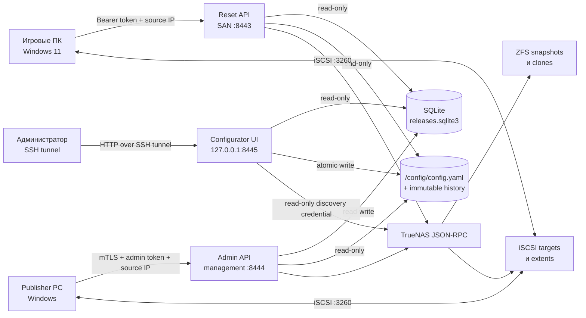
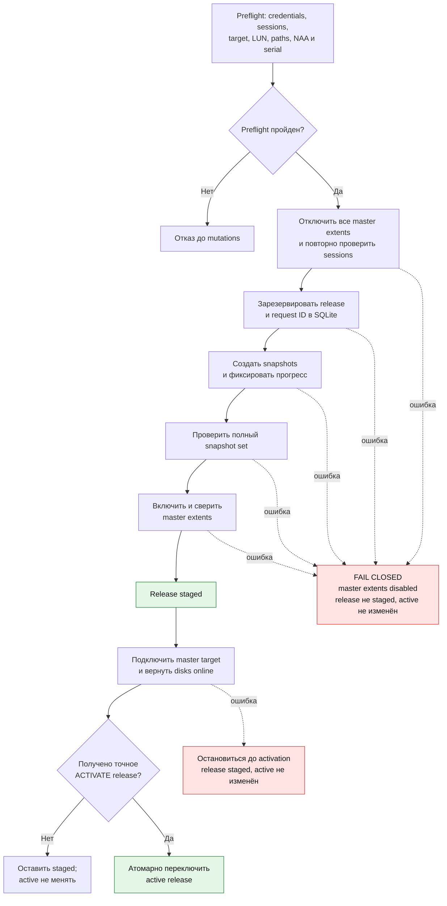
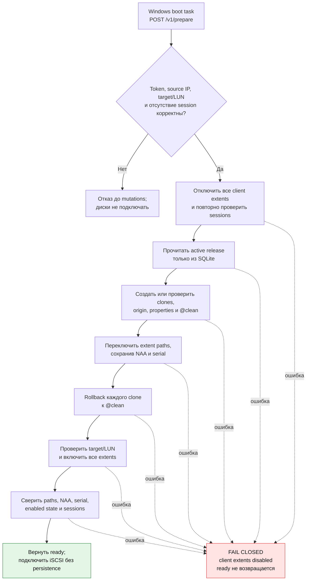

# iSCSI Reset Service v0.3.0

Fail-closed комплект для TrueNAS SCALE 25.10 и Windows 11:

- при загрузке игрового ПК откатывает его writable ZFS-клоны к `@clean`;
- лениво переключает клиент на текущий active release;
- публикует согласованный набор master snapshots через отдельный management API;
- даёт loopback-only GUI для безопасного выбора существующей TrueNAS topology;
- не сообщает игровому Windows-клиенту release name или ZFS paths.

Инструкции для следующих coding-агентов, включая обязательные safety-инварианты и матрицу
проверок, находятся в [AGENTS.md](AGENTS.md).

## Как это работает

### Компоненты



### Публикация release



### Сброс клиента



## Сеть и компоненты

| Назначение | Адрес |
|---|---|
| iSCSI portal | `10.20.40.10:3260` |
| Reset API для игровых ПК | `https://10.20.40.10:8443` |
| Release admin API, local bind | `https://<ADMIN_BIND_IP>:8444` |
| Release admin API для Publisher | `https://<ADMIN_CONNECT_IP>:8444` |
| Configurator через SSH tunnel | `http://127.0.0.1:8445` |

Без NAT `ADMIN_BIND_IP` и `ADMIN_CONNECT_IP` обычно совпадают. При DNAT первый адрес обязан быть
реально назначен интерфейсу TrueNAS, а второй — это адрес, который Publisher указывает в URL.

Custom App запускает три одинаково ограниченных контейнера из одного image digest. Reset API
читает SQLite read-only; admin API изменяет её; configurator читает SQLite read-only и один
имеет write-доступ к каталогу `/config`. Admin API не слушает SAN IP и требует одновременно:

- сертификат клиента, выданный отдельным local CA;
- отдельный Bearer admin token;
- точный source IP Publisher PC из YAML, фактически наблюдаемый приложением после NAT.

Все три контейнера работают как `10001:10001`, с read-only root filesystem, `cap_drop: ALL`, без
privileged, Docker socket и `/dev/zvol`.

## Как volumes связываются между собой

`ssd` и `hdd` — произвольные ключи, а не встроенные типы. Один ключ связывает:

```text
publisher.volumes.ssd.dataset
        ↓ snapshot текущего release
SQLite: release → snapshots.ssd
        ↓ clone
clients.<client>.volumes.ssd → extent ID/LUN/drive letter
```

Клиент может использовать подмножество publisher volumes. Для каждого используемого volume
`clone_parent` обязан находиться в том же ZFS pool, что и master dataset.

Пример путей для `games-2026.08.18.2`:

```text
nvme/masters/games-ssd@games-2026.08.18.2
nvme/clients/chimera/ssd__games-2026.08.18.2
nvme/clients/chimera/ssd__games-2026.08.18.2@clean
```

## Конфигурация v2 и SQLite

YAML содержит только статическую topology. Releases и active pointer находятся в
`/state/releases.sqlite3`. Предпочтительный путь настройки — configurator: он предлагает portal,
target, extent, LUN, master dataset и clone parent только из актуального read-only discovery,
а затем повторно сверяет TrueNAS, schema v2 и SQLite перед записью. Ручной путь остаётся доступен:
скопируйте `config/config.example.yaml` и замените IP, IQN, extent ID, LUN и token digests.

Проверка:

```bash
iscsi-reset-service config validate --path /config/config.yaml
```

Сервис генерирует имена `games-YYYY.MM.DD.N` в настроенной timezone. До публикации и активации
первого release reset `/readyz` возвращает `503`. Старые releases, snapshots и clones не
удаляются автоматически.

Configurator и структурные формы используют одну draft-модель. Advanced YAML разбирается
safe-loader с запретом duplicate keys и после проверки сериализуется канонически: комментарии и
исходное форматирование не сохраняются. Сохранение использует `base_revision`, файловый lock,
immutable copy в `/config/history`, `fsync`, mode `0600` и атомарный `os.replace`. Hot reload и
автоматический redeploy отсутствуют: после записи нужно перезапустить весь Custom App.

Формат v1 намеренно не импортируется автоматически. Пошаговое преобразование описано в
`MIGRATION-v1-v2.md`.

## Первичная подготовка TrueNAS до установки Custom App

Это одноразовый bootstrap. App намеренно **не создаёт** pools, datasets, zvol, iSCSI objects,
пользователей, API keys или сертификаты. Сначала подготовьте их в TrueNAS, и только потом
устанавливайте release YAML. Storage objects создавайте через TrueNAS UI или документированный
middleware API, а не прямыми `zfs`-командами: middleware должен видеть всю topology.

Ниже `tank`, `nvme`, IP, IQN, размеры и имена клиентов — примеры. Замените их своими значениями
согласованно в TrueNAS, release YAML и `config.yaml`.

### 1. Составьте topology worksheet

Для каждого logical volume и клиента заранее заполните таблицу. Ключи `ssd`/`hdd` произвольны;
количество volumes также произвольно.

| Поле | Пример |
|---|---|
| Logical volume | `ssd` |
| Master zvol | `nvme/masters/games-ssd` |
| Publisher extent ID / LUN | `10 / 0` |
| Publisher SAN IP / IQN | `10.20.40.100` / `iqn....:publisher` |
| Client | `chimera` |
| Client clone parent | `nvme/clients/chimera` |
| Client extent ID / LUN | `1 / 0` |
| Client SAN IP / IQN | `10.20.40.101` / `iqn....:chimera` |
| Windows letter / label | `S` / `GAMES_SSD` |

IP, IQN, target и extent ID должны быть глобально уникальны. Один client target принадлежит
ровно одному ПК. Clone parent каждого volume обязан находиться в том же ZFS pool, что и его
master zvol.

### 2. Создайте ZFS topology через Storage → Datasets

1. Для каждого publisher volume создайте master **zvol** нужного размера, например
   `nvme/masters/games-ssd`. Если промежуточного Filesystem dataset `nvme/masters` ещё нет,
   сначала создайте его. Размер и block size после подключения Windows менять не следует.
2. Для каждого клиента и каждого используемого pool создайте пустой **Filesystem dataset** —
   clone parent, например `nvme/clients/chimera`; промежуточный `nvme/clients` также является
   Filesystem dataset. Не создавайте release clones вручную: их создаёт сервис после activation.
3. Для первоначального client extent создайте внутри clone parent отдельный bootstrap zvol
   того же размера, например `nvme/clients/chimera/ssd__bootstrap`. Он нужен только для создания
   постоянного TrueNAS extent record. Не подключайте и не форматируйте его на игровом ПК.
4. Исключите все `*/clients/*` из periodic snapshot tasks. App сам создаёт только точечные
   `@clean` snapshots и никогда автоматически не удаляет старые clones или snapshots.

Отдельно создайте parent `tank/iscsi-reset`, а под ним четыре служебных **Filesystem datasets**
без SMB/NFS shares:

```text
tank/iscsi-reset/config   → /mnt/tank/iscsi-reset/config
tank/iscsi-reset/state    → /mnt/tank/iscsi-reset/state
tank/iscsi-reset/secrets  → /mnt/tank/iscsi-reset/secrets
tank/iscsi-reset/tls      → /mnt/tank/iscsi-reset/tls
```

Используйте Generic preset и POSIX permissions. Если datasets зашифрованы, они должны быть
разблокированы до запуска App. `config` и `state` включите в backup; client clones туда не
включайте.

После создания datasets откройте **System → Shell** и задайте числового владельца контейнеров.
Создавать пользователя `10001` на TrueNAS не требуется:

```bash
sudo -i
install -d -o 10001 -g 10001 -m 0700 \
  /mnt/tank/iscsi-reset/config \
  /mnt/tank/iscsi-reset/state \
  /mnt/tank/iscsi-reset/secrets \
  /mnt/tank/iscsi-reset/tls
```

Не создавайте вручную пустой `/state/releases.sqlite3`: admin service создаст и инициализирует
его только после появления валидного config. Не создавайте пустой `config.yaml` — это невалидный
config, а не признак первого запуска.

### 3. Создайте iSCSI objects через Shares → Block (iSCSI)

1. Создайте portal на SAN address, например `10.20.40.10:3260`.
2. Создайте publisher initiator group и укажите в нём только точный IQN Publisher PC. Затем
   создайте publisher target: в **Authorized Networks** самого target добавьте SAN address
   `10.20.40.100/32`, а в **Add Groups** выберите подготовленные portal и initiator group.
3. Для каждого master zvol создайте отдельный **Device/DISK extent**, затем target–extent
   association с выбранным LUN. Сохраните extent ID, NAA и serial.
4. Для каждого игрового ПК создайте отдельный initiator group с точным IQN. Создайте отдельный
   target, добавьте его SAN address с маской `/32` в **Authorized Networks** target и свяжите
   target с нужными portal и initiator group через **Add Groups**. IP в форме initiator group
   указывать не нужно.
5. Для каждого client volume создайте отдельный постоянный Device/DISK extent, первоначально
   направленный на его `__bootstrap` zvol, и association с нужным LUN. Сохраните extent ID, NAA
   и serial, затем **выключите client extent**. File extents не поддерживаются.
6. Не переиспользуйте publisher/client extent records между targets. App меняет у существующего
   client extent только `disk` и `enabled`; ID, NAA и serial должны остаться постоянными.
7. Теперь master zvol можно один раз подключить, инициализировать и наполнить на Publisher PC.
   Делайте это только на заведомо пустых master LUN после сверки target и NAA. Клиентские
   bootstrap zvol не подключайте и не инициализируйте. Service/PowerShell provisioning-команд
   не выполняют.

Перед продолжением в TrueNAS UI ещё раз сверяйте worksheet: portal, полный target IQN, extent
ID, dataset path, LUN, NAA, serial, initiator IQN и authorized network.

### 4. Создайте два API credentials с разными privileges

В TrueNAS 25.10 роли назначаются privilege-объекту, связанному с local group; API key создаётся
для пользователя этой группы. Создайте две local groups, двух непривилегированных пользователей
без password login, SSH, sudo и web shell, затем два custom privileges и два API keys. Не
используйте `root` или `truenas_admin`. Поскольку [TrueNAS 25.10 UI reference](https://www.truenas.com/docs/scale/25.10/scaleuireference/credentials/localgroupsscreens/#add-and-edit-privilege-screens)
для web UI считает поддерживаемыми только три aggregate admin roles, точный least-privilege
набор ниже создаётся через штатный `privilege.create` с помощью `midclt`.

| Credential | Пользователь | Roles |
|---|---|---|
| Runtime reset/admin | `iscsi-reset-service` | `DATASET_READ`, `DATASET_WRITE`, `SNAPSHOT_READ`, `SNAPSHOT_WRITE`, `SHARING_ISCSI_GLOBAL_READ`, `SHARING_ISCSI_EXTENT_READ`, `SHARING_ISCSI_EXTENT_WRITE`, `SHARING_ISCSI_TARGET_READ`, `SHARING_ISCSI_TARGETEXTENT_READ` |
| Configurator discovery | `iscsi-reset-configurator` | `DATASET_READ`, `SHARING_ISCSI_GLOBAL_READ`, `SHARING_ISCSI_PORTAL_READ`, `SHARING_ISCSI_TARGET_READ`, `SHARING_ISCSI_EXTENT_READ`, `SHARING_ISCSI_TARGETEXTENT_READ`, `SHARING_ISCSI_INITIATOR_READ` |

Практический порядок:

1. В **Credentials → Groups** создайте группы `iscsi-reset-service` и
   `iscsi-reset-configurator`, не выдавая им sudo или SMB access.
2. Узнайте внутренние `id` групп (не путать с Unix GID):

   ```bash
   midclt call group.query '[["group","in",["iscsi-reset-service","iscsi-reset-configurator"]]]' \
     '{"select":["id","gid","group"]}'
   ```

3. Создайте privileges штатным middleware API, заменив два placeholder ID. Эти payloads не
   дают web shell:

   ```bash
   midclt call privilege.create '{
     "name": "iSCSI Reset runtime",
     "local_groups": [REPLACE_RUNTIME_GROUP_ID],
     "ds_groups": [],
     "roles": [
       "DATASET_READ", "DATASET_WRITE", "SNAPSHOT_READ", "SNAPSHOT_WRITE",
       "SHARING_ISCSI_GLOBAL_READ", "SHARING_ISCSI_EXTENT_READ",
       "SHARING_ISCSI_EXTENT_WRITE", "SHARING_ISCSI_TARGET_READ",
       "SHARING_ISCSI_TARGETEXTENT_READ"
     ],
     "web_shell": false
   }'

   midclt call privilege.create '{
     "name": "iSCSI Reset discovery",
     "local_groups": [REPLACE_DISCOVERY_GROUP_ID],
     "ds_groups": [],
     "roles": [
       "DATASET_READ", "SHARING_ISCSI_GLOBAL_READ", "SHARING_ISCSI_PORTAL_READ",
       "SHARING_ISCSI_TARGET_READ", "SHARING_ISCSI_EXTENT_READ",
       "SHARING_ISCSI_TARGETEXTENT_READ", "SHARING_ISCSI_INITIATOR_READ"
     ],
     "web_shell": false
   }'
   ```

4. В **Credentials → Users** создайте одноимённых пользователей с disabled password,
   shell `nologin`, без sudo и с соответствующей primary group.
5. Разверните строку каждого пользователя, нажмите **Add API Key**, задайте срок действия по
   вашей policy и сразу сохраните однажды показанный key. Старые user-linked keys при ротации
   отзывайте.

В документации [`pool.snapshot.rollback`](https://api.truenas.com/v25.10/api_methods_pool.snapshot.rollback.html)
указаны альтернативные роли `POOL_WRITE | SNAPSHOT_WRITE`. Runtime уже получает более узкую
`SNAPSHOT_WRITE`, необходимую также для create/clone, поэтому `POOL_WRITE` ему не выдаётся.
Discovery credential не должен иметь ни одной `*_WRITE` роли. Актуальную модель назначения и
список ролей проверяйте по
[TrueNAS 25.10 RBAC](https://api.truenas.com/v25.10/rbac.html) и
[`privilege.roles`](https://api.truenas.com/v25.10/api_methods_privilege.roles.html). Точный
least-privilege набор всё равно нужно подтвердить на своей patch release тестовыми read/write
вызовами из `TEST-PLAN.md`.

Сохраните только значения API keys в файлы без завершающих комментариев:

```text
/mnt/tank/iscsi-reset/secrets/truenas_api_key
/mnt/tank/iscsi-reset/secrets/truenas_discovery_api_key
```

Не передавайте key в аргументе shell-команды и не оставляйте его в history. Запишите файлы через
защищённый editor или stdin, затем сразу задайте владельца `10001:10001` и mode `0400`.

### 5. Подготовьте peppers и configurator login

Создайте два независимых текстовых peppers. Команда ниже пишет 32 random bytes в hex form и не
выводит секреты в терминал:

```bash
umask 077
openssl rand -hex 32 > /mnt/tank/iscsi-reset/secrets/token_pepper
openssl rand -hex 32 > /mnt/tank/iscsi-reset/secrets/admin_token_pepper
chown 10001:10001 /mnt/tank/iscsi-reset/secrets/*
chmod 0400 /mnt/tank/iscsi-reset/secrets/*
```

До установки App нужен только отдельный configurator login token. Сгенерируйте его в доверенном
терминале TrueNAS без session recording; команда не требует network access внутри контейнера:

```bash
docker run --rm --network none --read-only --user 10001:10001 \
  --cap-drop ALL --security-opt no-new-privileges \
  -v /mnt/tank/iscsi-reset/secrets/admin_token_pepper:/run/secrets/admin_token_pepper:ro \
  ghcr.io/xerz/iscsi-reset-service@sha256:7819da963b44e5673c0d9a446c5edbc7cdf47b0c6976ecd251178c20ae5329c7 \
  configurator-token generate --pepper-file /run/secrets/admin_token_pepper
```

Сразу сохраните показанный raw token в password manager. В файл
`/mnt/tank/iscsi-reset/secrets/configurator_token_digest` поместите **только** выведенную строку
`hmac-sha256:...`; весь JSON перенаправлять в файл нельзя, потому что в нём есть raw token.
Затем снова выполните `chown 10001:10001` и `chmod 0400` для digest-файла.

Client/admin tokens на этом этапе не нужны: предпочтительно сгенерировать их позже в GUI. Raw
tokens показываются один раз и не должны попадать в shell history, config, логи или audit.

### 6. Положите TLS-файлы

Подготовьте следующие host files до установки App — иначе соответствующие bind mounts не
создадутся корректно:

| Host file | Требование |
|---|---|
| `tls/reset-server.crt` / `tls/reset-server.key` | Server certificate с SAN `IP:10.20.40.10` |
| `tls/admin-server.crt` / `tls/admin-server.key` | Server certificate с SAN IP, который Publisher использует в Admin API URL |
| `tls/admin-client-ca.crt` | CA, которой подписан Publisher client certificate |

Publisher PC отдельно получает admin server CA, client certificate с EKU `Client
Authentication` и PFX/private key. Игровые ПК получают только CA reset server. PFX и client
private key в TrueNAS App не монтируются.

#### Пошаговый вариант для собственной PKI

Если в сети уже есть корпоративный CA, лучше запросить у него три leaf certificates с такими
же SAN/EKU. Если CA нет, команды ниже создают три независимых private CA:

- reset server CA подписывает только HTTPS certificate Reset API;
- admin server CA подписывает только HTTPS certificate Admin API;
- admin client CA подписывает только mTLS certificate Publisher PC.

Генерируйте PKI на отдельном доверенном компьютере с **OpenSSL 3.x**, а не внутри App. Закрытые
ключи CA на TrueNAS и Windows не копируйте. Команды интерактивно запросят passwords для трёх CA
keys и отдельно password для PFX; passwords не передавайте через command-line arguments.

Сначала проверьте версию, создайте новый пустой каталог и укажите реальные IP.
`ADMIN_CONNECT_IP` — адрес из `ApiBaseUrl` на Publisher PC. Это может быть NAT/VIP и он не обязан
совпадать с локальным адресом, на котором контейнер слушает `:8444`:

```bash
openssl version
umask 077
mkdir iscsi-reset-pki
cd iscsi-reset-pki

RESET_IP=10.20.40.10
ADMIN_CONNECT_IP=192.168.1.150
```

Например, при DNAT `192.168.1.150:8444 → 192.168.3.218:8444` certificate получает SAN
`192.168.1.150`, а в release YAML задаётся `ADMIN_BIND_HOST: 192.168.3.218`. Локальный bind IP
не требуется добавлять в SAN, пока ни один TLS client не обращается к нему напрямую. Если нужны
оба варианта подключения, добавьте оба: `subjectAltName=IP:192.168.1.150,IP:192.168.3.218`.

`openssl version` должен показывать `OpenSSL 3.x`, не LibreSSL. Каталог не переиспользуйте для
повторной генерации: при ошибке начните с нового пустого каталога.

Создайте CA и server certificate для Reset API:

```bash
openssl genpkey -algorithm RSA -pkeyopt rsa_keygen_bits:3072 \
  -aes-256-cbc -out reset-ca.key

openssl req -x509 -new -sha256 -days 3650 \
  -key reset-ca.key -out reset-ca.crt \
  -subj "/CN=iSCSI Reset Server CA" \
  -addext "basicConstraints=critical,CA:TRUE,pathlen:0" \
  -addext "keyUsage=critical,keyCertSign,cRLSign"

openssl genpkey -algorithm RSA -pkeyopt rsa_keygen_bits:3072 \
  -out reset-server.key

openssl req -new -sha256 \
  -key reset-server.key -out reset-server.csr \
  -subj "/CN=iscsi-reset-api" \
  -addext "basicConstraints=critical,CA:FALSE" \
  -addext "keyUsage=critical,digitalSignature,keyEncipherment" \
  -addext "extendedKeyUsage=serverAuth" \
  -addext "subjectAltName=IP:${RESET_IP}"

openssl x509 -req -sha256 -days 825 \
  -in reset-server.csr \
  -CA reset-ca.crt -CAkey reset-ca.key -CAcreateserial \
  -copy_extensions copy -out reset-server.crt
```

Создайте отдельный CA и server certificate для Admin API:

```bash
openssl genpkey -algorithm RSA -pkeyopt rsa_keygen_bits:3072 \
  -aes-256-cbc -out admin-server-ca.key

openssl req -x509 -new -sha256 -days 3650 \
  -key admin-server-ca.key -out admin-ca.crt \
  -subj "/CN=iSCSI Reset Admin Server CA" \
  -addext "basicConstraints=critical,CA:TRUE,pathlen:0" \
  -addext "keyUsage=critical,keyCertSign,cRLSign"

openssl genpkey -algorithm RSA -pkeyopt rsa_keygen_bits:3072 \
  -out admin-server.key

openssl req -new -sha256 \
  -key admin-server.key -out admin-server.csr \
  -subj "/CN=iscsi-reset-admin" \
  -addext "basicConstraints=critical,CA:FALSE" \
  -addext "keyUsage=critical,digitalSignature,keyEncipherment" \
  -addext "extendedKeyUsage=serverAuth" \
  -addext "subjectAltName=IP:${ADMIN_CONNECT_IP}"

openssl x509 -req -sha256 -days 825 \
  -in admin-server.csr \
  -CA admin-ca.crt -CAkey admin-server-ca.key -CAcreateserial \
  -copy_extensions copy -out admin-server.crt
```

Создайте третий CA, client certificate Publisher PC и password-protected PFX:

```bash
openssl genpkey -algorithm RSA -pkeyopt rsa_keygen_bits:3072 \
  -aes-256-cbc -out admin-client-ca.key

openssl req -x509 -new -sha256 -days 3650 \
  -key admin-client-ca.key -out admin-client-ca.crt \
  -subj "/CN=iSCSI Reset Admin Client CA" \
  -addext "basicConstraints=critical,CA:TRUE,pathlen:0" \
  -addext "keyUsage=critical,keyCertSign,cRLSign"

openssl genpkey -algorithm RSA -pkeyopt rsa_keygen_bits:3072 \
  -out publisher-client.key

openssl req -new -sha256 \
  -key publisher-client.key -out publisher-client.csr \
  -subj "/CN=iscsi-reset-publisher" \
  -addext "basicConstraints=critical,CA:FALSE" \
  -addext "keyUsage=critical,digitalSignature" \
  -addext "extendedKeyUsage=clientAuth"

openssl x509 -req -sha256 -days 825 \
  -in publisher-client.csr \
  -CA admin-client-ca.crt -CAkey admin-client-ca.key -CAcreateserial \
  -copy_extensions copy -out publisher-client.crt

openssl pkcs12 -export \
  -inkey publisher-client.key \
  -in publisher-client.crt \
  -certfile admin-client-ca.crt \
  -name "iSCSI Reset Publisher" \
  -out publisher-client.pfx
```

Leaf private keys `reset-server.key`, `admin-server.key` и `publisher-client.key` намеренно
создаются без password: сервер стартует non-interactively, а Publisher импортирует закрытый key
из зашифрованного PFX. Поэтому рабочий каталог должен оставаться закрытым, а PFX обязан иметь
сильный отдельный password.

Проверьте цепочки, назначение certificates и оба IP до копирования:

```bash
openssl verify -CAfile reset-ca.crt -purpose sslserver reset-server.crt
openssl verify -CAfile admin-ca.crt -purpose sslserver admin-server.crt
openssl verify -CAfile admin-client-ca.crt -purpose sslclient publisher-client.crt

openssl x509 -in reset-server.crt -noout -checkip "$RESET_IP"
openssl x509 -in admin-server.crt -noout -checkip "$ADMIN_CONNECT_IP"

openssl x509 -in reset-server.crt -noout -subject -issuer -dates \
  -ext subjectAltName,extendedKeyUsage
openssl x509 -in admin-server.crt -noout -subject -issuer -dates \
  -ext subjectAltName,extendedKeyUsage
openssl x509 -in publisher-client.crt -noout -subject -issuer -dates \
  -ext extendedKeyUsage

openssl pkcs12 -in publisher-client.pfx -info -noout
```

Первые пять проверок должны закончиться `OK`/`does match certificate`; в Publisher certificate
должен быть `TLS Web Client Authentication`, а в двух server certificates — `TLS Web Server
Authentication` и правильный SAN IP.

Разложите только эти файлы:

| Назначение | Файлы |
|---|---|
| TrueNAS `/mnt/tank/iscsi-reset/tls` | `reset-server.crt`, `reset-server.key`, `admin-server.crt`, `admin-server.key`, `admin-client-ca.crt` |
| Publisher PC | `admin-ca.crt`, `publisher-client.pfx` и password PFX по отдельному защищённому каналу |
| Каждый игровой ПК | только `reset-ca.crt` |
| Offline encrypted backup | весь PKI-каталог, особенно три CA keys, certificates и serial-файлы для renewal |

Никогда не копируйте `reset-ca.key`, `admin-server-ca.key` или `admin-client-ca.key` на TrueNAS,
Publisher либо игровой ПК. `publisher-client.key` отдельно на Publisher не нужен: он уже внутри
PFX. CSR-файлы секретами не являются, но для работы App не нужны.

Импортировать эти certificates в системный раздел **Certificates** TrueNAS не требуется: App
читает PEM-файлы непосредственно через bind mounts. Передайте пять TrueNAS-файлов по SFTP/SCP
или другим защищённым способом сначала во временный закрытый каталог, затем установите их в
dataset. Например, после копирования в `/tmp/iscsi-reset-tls` выполните в TrueNAS Shell:

```bash
sudo install -o 10001 -g 10001 -m 0400 \
  /tmp/iscsi-reset-tls/reset-server.crt \
  /tmp/iscsi-reset-tls/reset-server.key \
  /tmp/iscsi-reset-tls/admin-server.crt \
  /tmp/iscsi-reset-tls/admin-server.key \
  /tmp/iscsi-reset-tls/admin-client-ca.crt \
  /mnt/tank/iscsi-reset/tls/

sudo stat -c '%u:%g %a %n' /mnt/tank/iscsi-reset/tls/*
```

Ожидание для всех пяти файлов: owner `10001:10001`, mode `400`. Если pool называется не `tank`,
замените путь. При последующей замене certificates нужен штатный restart всего Custom App.

### 7. Выберите способ создания первого config

Предпочтительный GUI bootstrap:

1. Оставьте `/mnt/tank/iscsi-reset/config` и `/mnt/tank/iscsi-reset/state` пустыми.
2. Установите Custom App из release YAML. Reset/admin временно будут перезапускаться из-за
   отсутствующего config; configurator на `127.0.0.1:8445` должен запуститься.
3. Откройте SSH tunnel и войдите однажды сохранённым raw configurator token.
4. Заполните пять разделов по инструкции ниже, сгенерируйте client/admin tokens и сохраните
   config. Configurator только читает TrueNAS discovery и не создаёт storage objects.
5. Убедитесь, что появился `/config/config.yaml` mode `0600`, затем перезапустите **весь**
   Custom App. Admin service создаст `/state/releases.sqlite3`; configurator должен показать
   одинаковые saved/startup revisions.

#### Открыть configurator через SSH tunnel

В **System → Services → SSH → Edit** обязательно включите **Allow TCP Port Forwarding**,
ограничьте SSH management-интерфейсом и используйте key authentication. Сохраните настройку и
запустите либо перезапустите SSH service. На административном компьютере выполните, подставив
SSH user, адрес и при необходимости `-p PORT`:

```bash
ssh -N -o ExitOnForwardFailure=yes \
  -L 127.0.0.1:8445:127.0.0.1:8445 \
  <ssh-user>@<TRUENAS_SSH_ADDRESS>
```

Терминал ничего не выводит и остаётся занят — это нормально, не закрывайте его. В другом
терминале можно проверить tunnel:

```bash
curl http://127.0.0.1:8445/healthz
```

Если SSH выводит `administratively prohibited: open failed`, сервер запретил forwarding:
повторно проверьте **System → Services → SSH → Edit → Allow TCP Port Forwarding**, сохраните
настройку, перезапустите SSH service и откройте новое SSH-соединение. Уже установленная SSH
сессия новую настройку не подхватит.

Затем откройте **`http://127.0.0.1:8445`** в browser. Это намеренно HTTP внутри зашифрованного
SSH tunnel. Введите raw token, который был показан при `configurator-token generate`; строка
`hmac-sha256:...` из secret-файла для входа не подходит. Если raw token потерян, восстановить
его из digest невозможно: сгенерируйте новую пару, замените
`configurator_token_digest`, задайте `10001:10001`/`0400` и перезапустите App.

#### Заполнить разделы configurator

1. **Статус:** убедитесь, что badge показывает `TrueNAS discovery OK`, а targets и datasets
   найдены. Если iSCSI objects менялись после входа, нажмите **Обновить discovery**.
2. **Сеть:** выберите существующий iSCSI portal; задайте canonical SAN CIDR, timezone и release
   prefix. В `Publisher management IP` укажите source IP Publisher, который Admin API фактически
   увидит после NAT, а не `ADMIN_CONNECT_IP` назначения. Нажмите **Сгенерировать admin token**,
   скопируйте raw token в password manager для Publisher PC и закройте dialog; digest форма
   подставит автоматически.
3. **Publisher:** введите SAN source IP и точный initiator IQN Publisher PC, выберите publisher
   target и нажмите **Заполнить из target**. Проверьте каждую строку: logical volume name,
   extent/LUN и master dataset должны соответствовать worksheet.
4. **Клиенты:** для каждого ПК нажмите **Добавить клиента**, задайте уникальное имя, SAN IP,
   точный initiator IQN и его отдельный target, затем нажмите **Заполнить из target**. Для
   каждого volume обязательно перепроверьте extent/LUN, drive letter, label и **Clone parent**:
   автоматически предложенный первый dataset нужного pool может быть не вашим client parent.
   Нажмите **Сгенерировать client token** и сохраните raw token отдельно для этого ПК.
5. **YAML:** обычно вручную не редактируйте. Он синхронизируется с формами; advanced-изменения
   нужно сначала провести через **Проверить и применить к формам**.

Raw tokens показываются только один раз. До закрытия dialog сохраните admin token и каждый
client token в password manager; в `config.yaml` останутся только HMAC digests.

В нижней панели нажмите **Проверить**. Исправьте все ошибки и предупреждения об отсутствии
точного IQN/authorized network, затем нажмите **Сохранить config.yaml**. После сообщения
`Требуется restart Custom App` откройте **Apps → Installed Applications**, найдите Custom App и
нажмите кнопку `restart_alt`. После запуска обновите страницу configurator: saved revision и
startup revision должны совпасть, а restart banner — исчезнуть.

Для ручного bootstrap сначала подготовьте schema v2 из `config/config.example.yaml`, замените
все example IP/IQN/extent/LUN/dataset и token digests, а затем установите файл:

```bash
install -o 10001 -g 10001 -m 0600 /tmp/config.yaml \
  /mnt/tank/iscsi-reset/config/config.yaml
```

До установки можно проверить его тем же release image:

```bash
docker run --rm --network none --read-only --user 10001:10001 \
  --cap-drop ALL --security-opt no-new-privileges \
  -v /mnt/tank/iscsi-reset/config:/config:ro \
  ghcr.io/xerz/iscsi-reset-service@sha256:7819da963b44e5673c0d9a446c5edbc7cdf47b0c6976ecd251178c20ae5329c7 \
  config validate --path /config/config.yaml
```

TrueNAS API соединение внутри host networking использует `wss://127.0.0.1/api/current`.
Отключение его TLS-проверки разрешено только вместе с
`TRUENAS_TLS_INSECURE_ACK=I_ACCEPT_MITM_RISK`.

## Установка Custom App и последующие токены

При GUI bootstrap client/admin tokens генерируются прямо в configurator после discovery. Если
config уже подготовлен вручную, эквивалентные CLI-команды выглядят так:

```bash
iscsi-reset-service token generate chimera \
  --config /config/config.yaml --pepper-file /run/secrets/token_pepper

iscsi-reset-service admin-token generate \
  --pepper-file /run/secrets/admin_token_pepper
```

Raw token показывается один раз. В YAML помещается только `token_digest`; raw-значение не
пишется в config, логи, audit или browser storage.

Универсальный шаблон `truenas/custom-app.yaml` требует заменить:

- GHCR image и immutable digest;
- `/mnt/tank/...` paths;
- `REPLACE_WITH_TRUENAS_MANAGEMENT_IP` — локальный `ADMIN_BIND_IP`, назначенный TrueNAS;
- example SAN address `10.20.40.10`, если у вас другой portal/reset IP;
- TLS/secrets filenames.

Для опубликованной версии удобнее скачать готовый release bundle: в нём все три службы уже
ссылаются на один публичный образ по immutable digest, поэтому GHCR credentials не нужны.

```bash
gh release download v0.3.0 \
  --pattern 'iscsi-reset-service-v0.3.0-truenas.yaml' \
  --pattern 'image-digest.txt' \
  --pattern 'SHA256SUMS'
sha256sum --check SHA256SUMS
```

В release YAML замените локальный admin bind IP, example SAN IP, `/mnt/tank/...` paths и при
необходимости имена TLS/secrets файлов. Все три `image:` уже закреплены на одном `sha256`
digest — их менять нельзя. Перед установкой полезно проверить оставшиеся site placeholders и
Compose syntax:

```bash
grep -nE 'REPLACE_|/mnt/tank|10\.20\.40\.10' \
  iscsi-reset-service-v0.3.0-truenas.yaml
docker compose -f iscsi-reset-service-v0.3.0-truenas.yaml config --quiet
```

Установите через **Apps → Discover Apps → Custom App → Install via YAML**. При GUI bootstrap
сначала откройте configurator, создайте config и перезапустите весь App, как описано выше.

### Контроль после первого полного restart

На TrueNAS проверьте владельцев и наличие только ожидаемых persistent files:

```bash
stat -c '%u:%g %a %n' \
  /mnt/tank/iscsi-reset/config \
  /mnt/tank/iscsi-reset/config/config.yaml \
  /mnt/tank/iscsi-reset/state \
  /mnt/tank/iscsi-reset/state/releases.sqlite3 \
  /mnt/tank/iscsi-reset/secrets/* \
  /mnt/tank/iscsi-reset/tls/*
```

Ожидание: каталоги принадлежат `10001:10001`, `config.yaml` имеет mode `0600`, secrets/keys —
`0400`; `releases.sqlite3` существует только после старта admin service с валидным config.
Затем проверьте API:

```bash
curl --cacert reset-ca.crt https://10.20.40.10:8443/healthz

curl --cacert admin-ca.crt \
  --cert publisher-client.crt --key publisher-client.key \
  https://<ADMIN_CONNECT_IP>:8444/healthz
```

Admin `/readyz` должен вернуть `ready`. Reset `/readyz` до первого activate закономерно
возвращает `503`, а после activation должен стать `ready`.

Для повторного доступа откройте SSH tunnel по инструкции bootstrap и перейдите на
`http://127.0.0.1:8445`. Сервер проверяет loopback client/Host/Origin,
использует отдельную session cookie (`HttpOnly`, `SameSite=Strict`), CSRF token, 30 минут idle и
8 часов maximum lifetime. Assets встроены в image; внешних CDN нет. После сохранения GUI
показывает saved/startup revisions и требует штатный restart всего Custom App. Hot reload и
автоматический redeploy отсутствуют.

## Установка на Publisher PC

Запустить elevated Windows PowerShell 5.1:

```powershell
$pfxPassword = Read-Host -AsSecureString "Client PFX password"
.\Install-IscsiReleasePublisher.ps1 `
  -ApiBaseUrl "https://<ADMIN_CONNECT_IP>:8444" `
  -AdminToken "<RAW_ADMIN_TOKEN>" `
  -CaCertificatePath ".\admin-ca.crt" `
  -ClientCertificatePfxPath ".\publisher-client.pfx" `
  -ClientCertificatePassword $pfxPassword
```

Installer импортирует CA и client certificate, а token/config сохраняет под
`C:\ProgramData\IscsiResetPublisher` с ACL только Administrators и SYSTEM.

Для публикации master target должен быть подключён к Publisher PC:

```powershell
C:\ProgramData\IscsiResetPublisher\Publish-IscsiRelease.ps1
```

Скрипт сначала сопоставляет полный набор master-дисков по NAA, переводит только их offline,
отключает target, сохраняет idempotency request ID и вызывает `stage`. После успешного `stage`
он сразу подключает master target и возвращает диски online, а уже затем просит напечатать
точную строку `ACTIVATE <release>`. При отказе release остаётся staged, active pointer не
меняется, а master-диски продолжают работать. При ошибке `stage` target остаётся отключённым;
при ошибке reconnect activation не выполняется, и следующий запуск сначала повторяет reconnect.

Сценарий никогда не вызывает `Initialize-Disk`, `Format-Volume`, `Clear-Disk`, `New-Partition`
или изменение разделов.

## Установка reset-клиента

Контракт и установка игрового клиента не изменились:

```powershell
.\Install-IscsiResetClient.ps1 `
  -ClientToken "<RAW_CLIENT_TOKEN>" `
  -CaCertificatePath ".\reset-ca.crt"
```

Scheduled Task запускается от SYSTEM при старте. Клиент получает только portal, свой target и
список `{lun, disk_unique_id, drive_letter, label}`. Login всегда `IsPersistent=false`; при
ошибке после подключения созданная сессия отключается.

## Fail-closed публикация

`POST /v1/admin/releases/stage`:

1. проверяет publisher session, target/LUN, extent path, NAA и serial;
2. выключает все master extents и повторно проверяет отсутствие session;
3. резервирует release и request ID в SQLite;
4. создаёт snapshots `recursive=false`, записывая прогресс после каждого;
5. проверяет полный набор, включает extents и сверяет invariants;
6. только после этого возвращает `staged`.

Частичная ошибка оставляет master extents выключенными и старый active release неизменным.
Повтор с тем же request ID продолжает incomplete release. Другой request ID получает
`409 RELEASE_INCOMPLETE`.

Activation требует JSON:

```json
{"confirmation":"ACTIVATE games-2026.08.18.2"}
```

Она одной SQLite-транзакцией меняет active pointer. Redeploy App не нужен.

## API

Reset API:

- `GET /healthz`, `GET /readyz`;
- `GET /v1/client`;
- `POST /v1/validate`;
- `POST /v1/prepare`.

Admin API:

- `GET /healthz`, `GET /readyz`;
- `GET /v1/admin/publisher`;
- `GET /v1/admin/releases`;
- `POST /v1/admin/releases/validate`;
- `POST /v1/admin/releases/stage`;
- `POST /v1/admin/releases/{release}/activate`.

Configurator API (только `127.0.0.1:8445`):

- `POST/DELETE /v1/configurator/session`;
- `GET /v1/configurator/status`, `/discovery`, `/config`;
- `POST /v1/configurator/config/validate`;
- `PUT /v1/configurator/config`;
- `POST /v1/configurator/tokens`.

Основные ошибки: `401`, `403 SOURCE_IP_MISMATCH`, `409 SESSION_ACTIVE` или release conflict,
`423 CLIENT_BUSY/RELEASE_BUSY`, `503 NOT_READY`.

## Проверка

```bash
python -m pip install -e '.[test]'
ruff check src tests
pytest -q
docker compose up --build --abort-on-container-exit --exit-code-from windows-simulation
docker compose down --volumes
```

На Windows PowerShell 5.1:

```powershell
Invoke-Pester .\powershell\tests -Output Detailed -CI
```

Результат локальной проверки записан в `VERIFICATION.md`. Реальные destructive проверки
сначала выполнять только по `TEST-PLAN.md` на отдельных тестовых zvol.

## Выпуск версии

Обычный CI и release workflow используют один полный gate: Python/Ruff, Pester на Windows
PowerShell 5.1 и Compose interaction suite. Публикация запускается тегом, который обязан точно
соответствовать версии в `pyproject.toml`, например `v0.3.0`.

После успешных проверок workflow публикует только точный version tag
`ghcr.io/xerz/iscsi-reset-service:v0.3.0`, фиксирует фактический digest, добавляет SBOM и
provenance attestation и создаёт GitHub Release. Mutable tag `latest` не создаётся. В release
прикладываются TrueNAS YAML, полная digest-ссылка и `SHA256SUMS`; реальный TrueNAS автоматически
не изменяется.

Backend соответствует TrueNAS 25.10 API: [sessions](https://api.truenas.com/v25.10/api_methods_iscsi.global.sessions.html),
[datasets](https://api.truenas.com/v25.10/api_methods_pool.dataset.query.html),
[targets](https://api.truenas.com/v25.10/api_methods_iscsi.target.query.html),
[extents](https://api.truenas.com/v25.10/api_methods_iscsi.extent.query.html),
[associations](https://api.truenas.com/v25.10/api_methods_iscsi.targetextent.query.html),
[initiators](https://api.truenas.com/v25.10/api_methods_iscsi.initiator.query.html),
[portals](https://api.truenas.com/v25.10/api_methods_iscsi.portal.query.html),
[snapshot create](https://api.truenas.com/v25.10/api_methods_pool.snapshot.create.html),
[snapshot clone](https://api.truenas.com/v25.10/api_methods_pool.snapshot.clone.html),
[rollback](https://api.truenas.com/v25.10/api_methods_pool.snapshot.rollback.html) и
[extent update](https://api.truenas.com/v25.10/api_methods_iscsi.extent.update.html).
