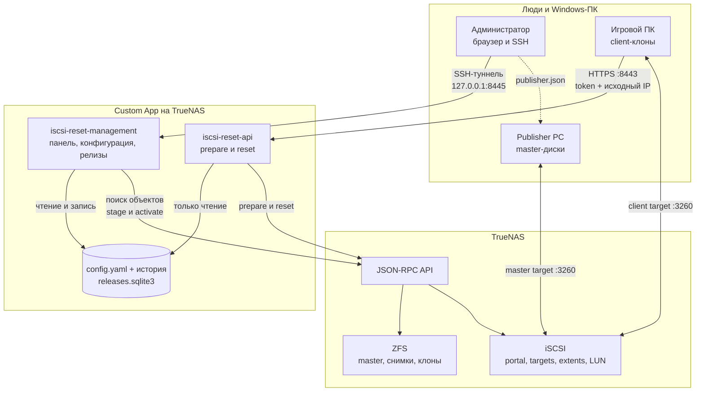
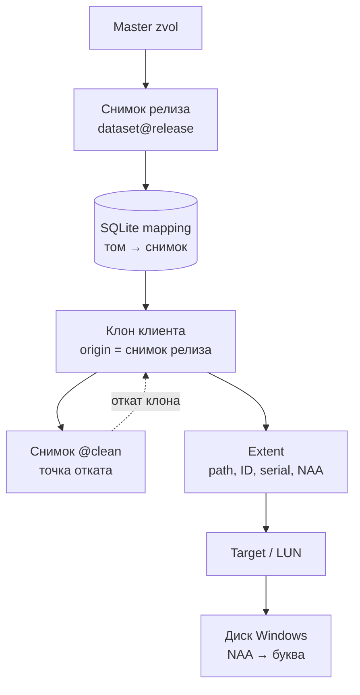
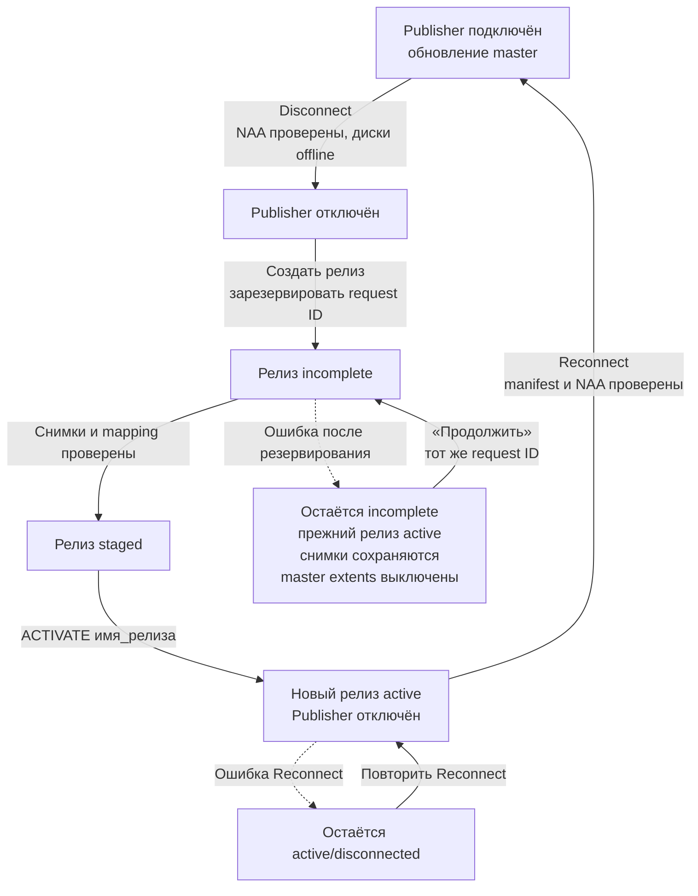
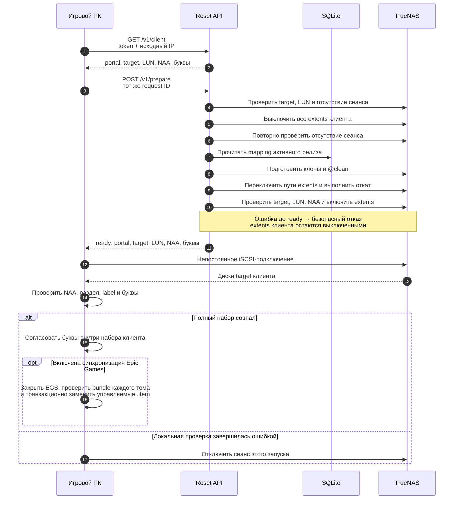

# iSCSI Reset Service v0.4.9

iSCSI Reset Service публикует согласованный набор снимков ZFS с игровых дисков и перед каждым
запуском игрового ПК возвращает его отдельные записываемые клоны к чистому состоянию. Один
компьютер-издатель (`Publisher`) хранит и обновляет эталонные тома. Каждый игровой ПК получает
собственные клоны и собственную цель iSCSI.

Проект рассчитан на TrueNAS SCALE 25.10 и Windows PowerShell 5.1. Он не создаёт автоматически
пулы, исходные zvol, цели iSCSI, пользователей TrueNAS или сертификаты: эти объекты оператор
готовит один раз до установки приложения.

## Гарантии безопасности

Основной принцип — безопасный отказ (`fail-closed`). Если сервис не может однозначно доказать
состояние всей группы томов, соответствующие extent остаются выключенными, а игровой клиент не
получает ответ `ready`.

- Идентичность каждого компьютера проверяется одновременно по точному IP, IQN и цели iSCSI.
  Один игровой клиент может находиться на том же физическом ПК, что и Publisher: тогда только
  их полная пара IP/IQN совпадает, а цели iSCSI обязательно различаются.
- Диски Windows сопоставляются только по NAA, а не по номеру, размеру, букве или порядку.
- Сначала выключается весь набор extent, затем повторно проверяются сеансы iSCSI, и только
  после этого меняются снимки или пути.
- Активный релиз и его соответствие томов снимкам хранятся только в SQLite; сервис не угадывает
  их по имени или времени создания.
- Частичная ошибка выпуска не переключает активный релиз, не удаляет снимки и оставляет
  эталонные extent выключенными до согласования состояния.
- Старые релизы, снимки и клоны никогда не удаляются автоматически.
- Контейнеры работают от `10001:10001`, с корневой файловой системой только для чтения,
  `cap_drop: ALL`, `no-new-privileges`, без `privileged`, Docker socket и `/dev/zvol`.

## Как устроена система

### Компоненты



Один физический ПК может выполнять роли Publisher и игрового клиента, но master target и
client target на нём подключаются по очереди.

В Custom App работают ровно два контейнера из одного образа, закреплённого неизменяемым
идентификатором содержимого (digest):

| Контейнер | Назначение | Доступ к данным | Сеть |
|---|---|---|---|
| `iscsi-reset-api` | Подготовка клонов игровых ПК | `config` и `state` только для чтения | HTTPS на SAN IP `:8443` |
| `iscsi-reset-management` | Панель, настройка, наблюдение и выпуск | `config` и `state` для чтения и записи | HTTP только на `127.0.0.1:8445` через SSH-туннель |

Publisher не обращается к API сервиса. Его вспомогательный PowerShell-скрипт локально отключает и подключает
эталонную цель по скачанному из панели `publisher.json`. В этом файле нет токена, сертификата
клиента или закрытого ключа.

### Как связаны тома, снимки и клоны

Имена томов, например `ssd` и `hdd`, — произвольные ключи конфигурации. Количество томов также
не фиксировано. Для одного ключа связь выглядит так:



Например, для релиза `games-2026.08.22.1` могут появиться:

```text
nvme/masters/games-ssd@games-2026.08.22.1
nvme/clients/chimera/ssd__games-2026.08.22.1
nvme/clients/chimera/ssd__games-2026.08.22.1@clean
```

Родительский набор данных для клонов (`clone parent`) — пустой Filesystem dataset, внутри
которого сервис создаёт клиентские zvol-клоны. Он обязан находиться в том же пуле ZFS, что и
эталонный zvol соответствующего тома. Клиент может использовать подмножество томов Publisher.

Статический `config.yaml` имеет только `schema_version: 3` и описывает сеть, идентичности,
extent, LUN и связь томов. Активный релиз, неизменяемое соответствие `volume → snapshot`,
состояния `incomplete` и `staged`, идентификаторы повторных запросов и журнал операций находятся
только в `/state/releases.sqlite3`. Конфигурация v2 намеренно отклоняется.

### Выпуск релиза



Активация выполняется до повторного подключения Publisher. Если `Reconnect` не удался,
автоматического отката нет: новый релиз остаётся активным, а панель показывает Publisher как
`disconnected`. Незавершённый выпуск продолжается тем же сохранённым `request ID`; другой
идентификатор не может обойти согласование.

### Запуск игрового клиента



Reset API возвращает `ready` только после проверки полного набора клонов, путей extent, LUN и
NAA; ошибка до этого ответа оставляет все extent клиента выключенными. После подключения
Windows отдельно сверяет полный набор дисков по NAA, единственный раздел данных, label и буквы.
При ошибке она отключает только сеанс, созданный текущим запуском.

## Что подготовить заранее

Нужны TrueNAS SCALE 25.10, отдельная SAN для iSCSI, один Publisher PC и хотя бы один игровой
ПК. На Windows должен быть доступен Windows PowerShell 5.1, а на доверенном компьютере для
создания собственной PKI — OpenSSL 3.x.

В примерах используются:

| Назначение | Пример |
|---|---|
| SAN | `10.20.40.0/24` |
| iSCSI portal и Reset API | `10.20.40.10` |
| Publisher | `10.20.40.100` |
| Игровой ПК `chimera` | `10.20.40.101` |
| Управляющий IP-адрес TrueNAS | `192.168.3.218` |
| Служебный пул | `tank` |

Управляющий IP-адрес — адрес интерфейса TrueNAS, доступный middleware API. Это не SAN
IP Publisher, не NAT/VIP для Publisher и не `127.0.0.1`.

### Таблица топологии

До создания объектов заполните таблицу для каждого логического тома и клиента:

| Поле | Пример |
|---|---|
| Ключ тома | `ssd` |
| Эталонный zvol | `nvme/masters/games-ssd` |
| Extent ID / LUN Publisher | `10 / 0` |
| IP / IQN Publisher | `10.20.40.100` / `iqn.1991-05.com.microsoft:publisher` |
| Клиент | `chimera` |
| Clone parent | `nvme/clients/chimera` |
| Extent ID / LUN клиента | `1 / 0` |
| IP / IQN клиента | `10.20.40.101` / `iqn.1991-05.com.microsoft:chimera` |
| Буква / метка Windows | `S` / `GAMES_SSD` |

Цель, digest токена и extent ID должны быть глобально уникальными. IP и IQN также уникальны,
кроме одного строго ограниченного случая: ровно один клиент может повторять одновременно и
`publisher.source_ip`, и `publisher.initiator_iqn`. Совпадение только одного из этих полей и
второй клиент с той же парой отклоняются как неоднозначная конфигурация. Даже у такого клиента
должна быть собственная цель iSCSI. LUN не должен повторяться внутри одной цели, а буква —
внутри одного клиента. Полный IQN Windows можно узнать командой `Get-InitiatorPort`.

## Первоначальная подготовка TrueNAS

### 1. Служебные наборы данных

В **Datasets → Add Dataset** создайте parent `tank/iscsi-reset`, затем четыре дочерних
Filesystem datasets без общих ресурсов SMB/NFS:

```text
tank/iscsi-reset/config   → /mnt/tank/iscsi-reset/config
tank/iscsi-reset/state    → /mnt/tank/iscsi-reset/state
tank/iscsi-reset/secrets  → /mnt/tank/iscsi-reset/secrets
tank/iscsi-reset/tls      → /mnt/tank/iscsi-reset/tls
```

Подходит обычный dataset с предустановкой `Generic`. TrueNAS сам монтирует его в
`/mnt/<pool>/<dataset>`; отдельную точку монтирования создавать не нужно. Не создавайте для
этих наборов данных сетевые общие ресурсы. Если они зашифрованы, разблокируйте их до запуска.
Каталоги `config` и `state` включите в резервное копирование.

Назначьте числового владельца контейнеров. Создавать пользователя `10001` в TrueNAS не нужно:

```bash
sudo chown 10001:10001 /mnt/tank/iscsi-reset/config \
  /mnt/tank/iscsi-reset/state \
  /mnt/tank/iscsi-reset/secrets \
  /mnt/tank/iscsi-reset/tls
sudo chmod 0700 /mnt/tank/iscsi-reset/config \
  /mnt/tank/iscsi-reset/state \
  /mnt/tank/iscsi-reset/secrets \
  /mnt/tank/iscsi-reset/tls
```

Не создавайте пустые `config.yaml` и `releases.sqlite3`. Отсутствие обоих файлов является
нормальным состоянием первой установки. Пустой файл считается повреждённым, а не начальным.

### 2. Эталонные zvol, родительские наборы клонов и начальные zvol

Через **Storage → Datasets** подготовьте хранилище:

1. Для каждого тома Publisher создайте эталонный zvol нужного размера, например
   `nvme/masters/games-ssd`. Промежуточный `nvme/masters` — Filesystem dataset.
2. Для каждого клиента и каждого используемого пула создайте пустой Filesystem dataset,
   например `nvme/clients/chimera`. Это clone parent; готовые релизные клоны вручную не
   создавайте.
3. В каждом clone parent создайте начальный zvol, например
   `nvme/clients/chimera/ssd__bootstrap`, того же размера, что эталон. Он нужен только для
   постоянной записи extent до появления первого клона.
4. Исключите `*/clients/*` из периодических задач снимков. Сервис сам создаёт точечные снимки
   `@clean` и не удаляет их автоматически.

Пример:

```text
SSDGames/MainGames                                      VOLUME, master
Sas/Games-Device/Older-Games/oldergames                 VOLUME, master
SSDGames/clients/chimera                                FILESYSTEM, clone parent
SSDGames/clients/chimera/ssd__bootstrap                 VOLUME, bootstrap
Sas/clients/chimera                                     FILESYSTEM, clone parent
Sas/clients/chimera/hdd__bootstrap                      VOLUME, bootstrap
```

Эталонный zvol обязан быть `VOLUME`, clone parent — `FILESYSTEM`. Объекты должны иметь
`locked: false`; `true` и `null` исключаются. Extent типа File и clone parent из другого пула
не поддерживаются.

### 3. Portal, группы инициаторов, цели, extent и связи

В **Shares → Block Shares (iSCSI)** создайте:

1. Один portal на выделенном SAN IP, например `10.20.40.10:3260`.
2. Отдельную initiator group для Publisher с его точным IQN.
3. Отдельную цель Publisher. В её **Authorized Networks** укажите точный SAN IP Publisher с
   `/32`, например `10.20.40.100/32`, а в группе цели выберите portal и initiator group.
4. Для каждого эталонного zvol — отдельный Device/DISK extent и association этой цели с
   фиксированным LUN. Сохраните ID, NAA и serial.
5. Для каждого игрового ПК — отдельные initiator group и target. В initiator group указывается
   только IQN; поля IP там нет. В **Authorized Networks** target укажите IP ПК с `/32`.
6. Для каждого клиентского тома — отдельный Device/DISK extent на соответствующий
   `__bootstrap` zvol и association с нужным LUN. После проверки выключите клиентский extent.

Не переиспользуйте запись extent между целями. Сервис меняет у клиентского extent только `disk`
и `enabled`; ID, NAA и serial сохраняются. Bootstrap zvol нельзя подключать или форматировать.
Эталонные zvol можно один раз подключить и наполнить на Publisher после ручной сверки цели и
NAA.

Если один физический ПК выполняет обе роли, создайте для его игрового режима отдельную client
target и отдельные client extent/association. Эта target может ссылаться на ту же initiator
group Publisher либо на другую группу с тем же точным IQN; в обоих случаях укажите тот же
`source_ip/32` в верхнеуровневом `target.auth_networks`. Master target и client target остаются
разными объектами, а их LUN и extent проверяются независимо.

Проверьте верхнеуровневое поле `target.auth_networks`. Оно не находится внутри `groups` или
объекта initiator:

```bash
midclt call iscsi.target.query '[["name","=","master"]]' |
  jq '.[0] | {id, name, auth_networks, groups}'
```

Для примера ожидается `auth_networks: ["10.20.40.100/32"]`. Более широкая сеть `/24` не
считается точной авторизацией Publisher.

### 4. Пользователи, роли и API keys

Панель использует два отдельных ключа TrueNAS:

| Назначение | Пользователь | Минимальные роли |
|---|---|---|
| Чтение и изменения хранилища | `iscsi-reset-service` | `DATASET_READ`, `DATASET_WRITE`, `SNAPSHOT_READ`, `SNAPSHOT_WRITE`, `SHARING_ISCSI_GLOBAL_READ`, `SHARING_ISCSI_EXTENT_READ`, `SHARING_ISCSI_EXTENT_WRITE`, `SHARING_ISCSI_TARGET_READ`, `SHARING_ISCSI_TARGETEXTENT_READ` |
| Обнаружение объектов (`discovery`) и наблюдение | `iscsi-reset-discovery` | `DATASET_READ`, `SNAPSHOT_READ`, `SHARING_ISCSI_GLOBAL_READ`, `SHARING_ISCSI_PORTAL_READ`, `SHARING_ISCSI_TARGET_READ`, `SHARING_ISCSI_EXTENT_READ`, `SHARING_ISCSI_TARGETEXTENT_READ`, `SHARING_ISCSI_INITIATOR_READ` |

Вторая учётная запись не должна иметь ни одной роли `*_WRITE`. `SNAPSHOT_READ` обязательна:
без неё формы могут получить основные объекты, но разделы «Обзор» и «Релизы» не смогут
проверить снимки релиза и клиентские `@clean`.

В TrueNAS 25.10 роли назначаются privilege, связанному с локальной группой. Практический
порядок:

1. Создайте локальные группы `iscsi-reset-service` и `iscsi-reset-discovery` без SMB, sudo и
   доступа к web shell.
2. Узнайте внутренние `id` групп, не путайте их с Unix GID:

   ```bash
   midclt call group.query \
     '[["group","in",["iscsi-reset-service","iscsi-reset-discovery"]]]' \
     '{"select":["id","gid","group"]}'
   ```

3. Создайте два privilege, подставив найденные ID:

   ```bash
   midclt call privilege.create '{
     "name": "iSCSI Reset service",
     "local_groups": [REPLACE_SERVICE_GROUP_ID],
     "ds_groups": [],
     "roles": [
       "DATASET_READ", "DATASET_WRITE", "SNAPSHOT_READ", "SNAPSHOT_WRITE",
       "SHARING_ISCSI_GLOBAL_READ", "SHARING_ISCSI_EXTENT_READ",
       "SHARING_ISCSI_EXTENT_WRITE", "SHARING_ISCSI_TARGET_READ",
       "SHARING_ISCSI_TARGETEXTENT_READ"
     ],
     "web_shell": false
   }'

   midclt call privilege.create '{
     "name": "iSCSI Reset discovery",
     "local_groups": [REPLACE_DISCOVERY_GROUP_ID],
     "ds_groups": [],
     "roles": [
       "DATASET_READ", "SNAPSHOT_READ", "SHARING_ISCSI_GLOBAL_READ",
       "SHARING_ISCSI_PORTAL_READ", "SHARING_ISCSI_TARGET_READ",
       "SHARING_ISCSI_EXTENT_READ", "SHARING_ISCSI_TARGETEXTENT_READ",
       "SHARING_ISCSI_INITIATOR_READ"
     ],
     "web_shell": false
   }'
   ```

4. Создайте одноимённых локальных пользователей с `nologin`, без sudo и password login, с
   соответствующей основной группой.
5. Для каждого пользователя создайте API key, задайте срок действия по своей политике и сразу
   сохраните однажды показанное значение.

Сверяйте роли с актуальными разделами официальной документации TrueNAS 25.10:
[RBAC](https://api.truenas.com/v25.10/rbac.html) и
[`privilege.create`](https://api.truenas.com/v25.10/api_methods_privilege.create.html).
Окончательный минимальный набор нужно подтвердить на своей patch-версии по `TEST-PLAN.md`.

Запишите только значения ключей в файлы:

```text
/mnt/tank/iscsi-reset/secrets/truenas_api_key
/mnt/tank/iscsi-reset/secrets/truenas_discovery_api_key
```

Не передавайте ключ в аргументе команды и не оставляйте его в истории shell. Откройте файл
через `sudo vi`, вставьте значение, сохраните, а затем выполните:

```bash
sudo chown 10001:10001 /mnt/tank/iscsi-reset/secrets/truenas_api_key \
  /mnt/tank/iscsi-reset/secrets/truenas_discovery_api_key
sudo chmod 0400 /mnt/tank/iscsi-reset/secrets/truenas_api_key \
  /mnt/tank/iscsi-reset/secrets/truenas_discovery_api_key
```

### 5. Peppers и токен панели

Pepper — отдельный секрет, добавляемый при вычислении HMAC. Создайте два независимых pepper:
один участвует в HMAC клиентских токенов, второй — токена панели. Оператору не нужно видеть
эти значения:

```bash
umask 077
openssl rand -hex 32 | sudo tee \
  /mnt/tank/iscsi-reset/secrets/token_pepper >/dev/null
openssl rand -hex 32 | sudo tee \
  /mnt/tank/iscsi-reset/secrets/management_token_pepper >/dev/null
sudo chown 10001:10001 /mnt/tank/iscsi-reset/secrets/token_pepper \
  /mnt/tank/iscsi-reset/secrets/management_token_pepper
sudo chmod 0400 /mnt/tank/iscsi-reset/secrets/token_pepper \
  /mnt/tank/iscsi-reset/secrets/management_token_pepper
```

Здесь используется `sudo tee`, потому что в команде `sudo openssl ... > file` перенаправление
`>` выполняет непривилегированная shell и может завершиться `permission denied`.

Если несуществующий файл раньше был указан как bind mount, Docker мог создать на его месте
каталог. Остановите Custom App, убедитесь, что каталог пуст, удалите именно этот каталог через
`sudo rmdir <полный-путь>`, а затем создайте обычный файл.

Сгенерируйте пару для входа в панель контейнером опубликованного образа:

```bash
docker run --rm --network none --read-only --user 10001:10001 \
  --cap-drop ALL --security-opt no-new-privileges \
  -v /mnt/tank/iscsi-reset/secrets/management_token_pepper:/run/secrets/management_token_pepper:ro \
  IMAGE_AT_IMMUTABLE_DIGEST \
  management-token generate --pepper-file /run/secrets/management_token_pepper
```

Команда один раз выводит исходный токен и `hmac-sha256:...`. Исходный токен сохраните только в
менеджере паролей. В
`/mnt/tank/iscsi-reset/secrets/management_token_digest` запишите только digest, затем:

```bash
sudo chown 10001:10001 /mnt/tank/iscsi-reset/secrets/management_token_digest
sudo chmod 0400 /mnt/tank/iscsi-reset/secrets/management_token_digest
```

Исходные токены нельзя помещать в YAML, shell history, логи, журнал операций или хранилище
браузера.

### 6. Собственная PKI для Reset API

Приложению нужны только сертификат и закрытый ключ HTTPS-сервера Reset API:

```text
/mnt/tank/iscsi-reset/tls/reset-server.crt
/mnt/tank/iscsi-reset/tls/reset-server.key
```

Игровые ПК получают только сертификат удостоверяющего центра `reset-ca.crt`. Закрытый ключ
удостоверяющего центра нельзя копировать ни на TrueNAS, ни на Windows. Дополнительные
сертификаты Publisher не нужны.

Если корпоративной PKI нет, выполните команды на доверенном компьютере с OpenSSL 3.x.
Подставьте SAN IP Reset API, по которому игровые ПК действительно обращаются к сервису:

```bash
openssl version
umask 077
mkdir iscsi-reset-pki
cd iscsi-reset-pki
RESET_IP=10.20.40.10

openssl genpkey -algorithm RSA -pkeyopt rsa_keygen_bits:3072 \
  -aes-256-cbc -out reset-ca.key
openssl req -x509 -new -sha256 -days 3650 \
  -key reset-ca.key -out reset-ca.crt \
  -subj "/CN=iSCSI Reset CA" \
  -addext "basicConstraints=critical,CA:TRUE,pathlen:0" \
  -addext "keyUsage=critical,keyCertSign,cRLSign"

openssl genpkey -algorithm RSA -pkeyopt rsa_keygen_bits:3072 \
  -out reset-server.key
openssl req -new -sha256 \
  -key reset-server.key -out reset-server.csr \
  -subj "/CN=iscsi-reset-api" \
  -addext "basicConstraints=critical,CA:FALSE" \
  -addext "keyUsage=critical,digitalSignature,keyEncipherment" \
  -addext "extendedKeyUsage=serverAuth" \
  -addext "subjectAltName=IP:${RESET_IP}"
openssl x509 -req -sha256 -days 825 \
  -in reset-server.csr \
  -CA reset-ca.crt -CAkey reset-ca.key -CAcreateserial \
  -copy_extensions copy -out reset-server.crt
```

Ключ сервера создаётся без пароля, потому что контейнер запускается без участия оператора.
Поэтому каталог PKI и копия ключа на TrueNAS должны быть доступны только владельцу. Проверьте
цепочку, назначение и IP:

```bash
openssl verify -CAfile reset-ca.crt -purpose sslserver reset-server.crt
openssl x509 -in reset-server.crt -noout -checkip "$RESET_IP"
openssl x509 -in reset-server.crt -noout -subject -issuer -dates \
  -ext subjectAltName,extendedKeyUsage
```

Передайте `reset-server.crt` и `reset-server.key` на TrueNAS защищённым способом, затем:

```bash
sudo chown 10001:10001 /mnt/tank/iscsi-reset/tls/reset-server.crt \
  /mnt/tank/iscsi-reset/tls/reset-server.key
sudo chmod 0400 /mnt/tank/iscsi-reset/tls/reset-server.crt \
  /mnt/tank/iscsi-reset/tls/reset-server.key
```

## Скачивание комплекта выпуска

GitHub Release содержит ровно семь самостоятельных файлов:

| Файл | Назначение |
|---|---|
| `iscsi-reset-service-vX.Y.Z-truenas.yaml` | Custom App с закреплённым digest образа |
| `image-digest.txt` | Полная ссылка на опубликованный образ |
| `SHA256SUMS` | Контрольные суммы остальных шести файлов |
| `Install-IscsiReleasePublisher.ps1` | Установщик вспомогательного скрипта Publisher |
| `Publish-IscsiRelease.ps1` | Локальное отключение и подключение Publisher |
| `Install-IscsiResetClient.ps1` | Установщик игрового клиента |
| `Reset-And-Connect.ps1` | Подготовка и непостоянное подключение игрового ПК |

`publisher.json` не входит в выпуск: он привязан к редакции конкретной установки и скачивается
из панели управления.

Скачайте все семь файлов в один каталог и обязательно проверьте контрольные суммы до запуска
YAML или PowerShell:

```bash
sha256sum --check SHA256SUMS
```

На macOS с системной утилитой `shasum`:

```bash
shasum -a 256 -c SHA256SUMS
```

Каждая из шести строк должна завершиться `OK`. Дополнительно убедитесь, что содержимое
`image-digest.txt` совпадает с двумя полями `image:` в YAML.

## Установка Custom App

1. Откройте скачанный `iscsi-reset-service-vX.Y.Z-truenas.yaml`.
2. Замените каждый путь `/mnt/tank/...` на подготовленные пути своей системы.
3. Замените оба `REPLACE_WITH_TRUENAS_MANAGEMENT_IP` на назначенный управляющий IP-адрес TrueNAS,
   например `192.168.3.218`. Не используйте `127.0.0.1`: внутри контейнера это сам контейнер,
   а не TrueNAS middleware.
4. Если SAN IP Reset API отличается от примера, замените `BIND_HOST` и проверьте SAN
   сертификата.
5. Проверьте YAML:

   ```bash
   docker compose -f iscsi-reset-service-vX.Y.Z-truenas.yaml config --quiet
   ```

6. В TrueNAS откройте **Apps → Discover Apps → Custom App**, выберите установку через YAML и
   вставьте подготовленный файл.
7. После старта убедитесь, что работают ровно два контейнера и панель не опубликована на
   внешнем интерфейсе.

Временное отключение проверки TLS между контейнером и TrueNAS разрешено шаблоном только вместе
с `TRUENAS_TLS_INSECURE_ACK=I_ACCEPT_MITM_RISK`. Этот параметр явно признаёт риск перехвата;
предпочтительно установить доверенную цепочку TrueNAS и включить проверку.

## Первоначальная настройка через панель

### SSH-туннель

В **System → Services → SSH → Edit** включите **Allow TCP Port Forwarding**. Ограничьте SSH
доверенными пользователями и ключами. На рабочем компьютере откройте туннель:

```bash
ssh -N -L 8445:127.0.0.1:8445 <user>@<truenas-management-ip>
```

Команда остаётся запущенной и обычно ничего не выводит. В другом терминале проверьте:

```bash
curl http://127.0.0.1:8445/healthz
```

Затем откройте `http://127.0.0.1:8445` и войдите исходным токеном панели. Digest из файла
для входа не подходит. Сессия хранится в `HttpOnly`/`SameSite=Strict` cookie, простаивает не
дольше 30 минут и в любом случае завершается через 8 часов.

Если SSH сообщает `administratively prohibited: open failed`, настройка TCP forwarding не
включена либо старое SSH-соединение ещё не подхватило её. Сохраните настройку, при необходимости
перезапустите SSH и откройте новое соединение.

### Конфигурация v3

Панель содержит разделы «Обзор», «Релизы», «Сеть», «Publisher», «Клиенты» и «YAML». Обнаружение
объектов (`discovery`) использует отдельный ключ только для чтения. Portal, target, extent, LUN,
эталонный dataset и clone parent выбираются из фактически найденных объектов TrueNAS.

Полный документированный образец находится в
[`config/config.example.yaml`](config/config.example.yaml). Основные поля имеют такой смысл:

- `allowed_source_cidr` задаёт общую допустимую SAN, но не заменяет точные `/32` в
  `target.auth_networks`;
- `portal` содержит адрес и порт iSCSI;
- `release_management.prefix` образует начало имени вида `games-YYYY.MM.DD.N`, а `timezone`
  определяет календарную дату;
- `publisher.volumes` связывает произвольный ключ тома с эталонным dataset, extent ID и LUN;
- `clients` хранит точные IP/IQN/target, HMAC digest токена и параметры каждого тома; один
  клиент может повторять полную пару IP/IQN Publisher, но обязан иметь отдельную target;
- `clone_parent` может быть общим для клиента или задан отдельно на томе; отдельное значение
  необходимо, когда тома находятся в разных пулах.

1. В «Сеть» задайте общую SAN, portal, префикс релиза и часовой пояс.
2. В «Publisher» выберите точные target, initiator IQN и эталонные тома.
3. В «Клиенты» добавьте каждый ПК, его IP/IQN/target, тома, буквы и метки.
4. Для каждого клиента сгенерируйте исходный client token. Скопируйте его сразу: в YAML сохраняется
   только HMAC digest, а исходное значение повторно не показывается.
5. Нажмите проверку, исправьте все ошибки и сохраните конфигурацию.
6. После записи сравните `saved revision` и `startup revision`, затем обязательно перезапустите
   весь Custom App. Горячей перезагрузки и автоматического redeploy нет.

Для dual-role ПК выберите у клиента те же IP и initiator IQN, что у Publisher, но его отдельную
client target. Обнаружение объектов проверит обе цели независимо: каждая должна иметь точные
IQN и `/32`, собственные associations, extent и LUN.

Формы и редактор YAML используют одну черновую модель. YAML загружается безопасным
разборщиком с запретом повторяющихся ключей и после проверки сериализуется канонически;
комментарии и исходное форматирование не сохраняются. Сохранение защищено `base_revision`,
файловой блокировкой, копией в `/config/history`, `fsync`, режимом `0600` и атомарной заменой.

После первого запуска с валидным конфигом панель создаёт `/state/releases.sqlite3`.
Отсутствие SQLite разрешено только при первой установке без валидного текущего конфига. До
первой активации `GET /readyz` Reset API закономерно возвращает `503`.

## Установка вспомогательного скрипта Publisher

Скачайте из GitHub Release оба файла Publisher:

```text
Install-IscsiReleasePublisher.ps1
Publish-IscsiRelease.ps1
```

После сохранения конфига и перезапуска App скачайте из панели актуальный `publisher.json`.
Перенесите три файла на Publisher и в повышенной Windows PowerShell 5.1 выполните:

```powershell
Set-ExecutionPolicy -Scope Process Bypass
./Install-IscsiReleasePublisher.ps1 -ManifestSourcePath ./publisher.json
```

Чтобы включить перенос установок Epic Games вместе с релизом, добавьте opt-in параметр:

```powershell
./Install-IscsiReleasePublisher.ps1 `
  -ManifestSourcePath ./publisher.json `
  -EpicGamesManifestSync Enabled
```

Для выделенного зеркала Publisher, которому нужен полный общий state EGS, используйте
`Aggressive` на обеих машинах:

```powershell
./Install-IscsiReleasePublisher.ps1 `
  -ManifestSourcePath ./publisher.json `
  -EpicGamesManifestSync Aggressive
```

Установщик копирует `publisher.json` и вспомогательный скрипт в
`C:\ProgramData\IscsiResetPublisher`, закрывает ACL по SID системной учётной записи и
встроенной группы администраторов и не сохраняет сетевые учётные данные. После изменения
конфигурации Publisher скачайте новый `publisher.json` и повторите установку до следующего
`Disconnect`. При `Reconnect` скрипт обновляет discovery указанного iSCSI portal и до 60 раз
с интервалом в одну секунду ждёт появления точного target IQN; существующий точный сеанс не
переподключается.

## Установка игрового клиента

Для игрового ПК скачайте из GitHub Release:

```text
Install-IscsiResetClient.ps1
Reset-And-Connect.ps1
```

Скопируйте на него также `reset-ca.crt`. Один раз показанный исходный client token не
подставляйте в командную строку: установщик запросит его скрыто, поэтому значение не попадёт в
историю PowerShell. В повышенной Windows PowerShell 5.1:

```powershell
Set-ExecutionPolicy -Scope Process Bypass
./Install-IscsiResetClient.ps1 -CaCertificatePath ./reset-ca.crt
```

На приглашении `Reset API IP [10.20.40.10]` нажмите Enter для указанного адреса либо введите
другой SAN IPv4. Затем вставьте токен в приглашение `Client token`: ввод маскируется. Если IP
заранее известен, его можно передать без секрета в истории:

```powershell
./Install-IscsiResetClient.ps1 `
  -CaCertificatePath ./reset-ca.crt `
  -ResetApiIp 10.20.40.10
```

Для автоматической регистрации сетевых Epic Games-игр установите клиент с тем же opt-in:

```powershell
./Install-IscsiResetClient.ps1 `
  -CaCertificatePath ./reset-ca.crt `
  -ResetApiIp 10.20.40.10 `
  -EpicGamesManifestSync Enabled
```

Для выделенного клиента-зеркала с полным набором Publisher-томов:

```powershell
./Install-IscsiResetClient.ps1 `
  -CaCertificatePath ./reset-ca.crt `
  -ResetApiIp 10.20.40.10 `
  -EpicGamesManifestSync Aggressive
```

Reset API всегда используется по `https://<введённый-IP>:8443`; hostname и IPv6 установщик
отклоняет. Установщик сначала закрывает ACL каталога
`C:\ProgramData\IscsiReset` по неизменяемым SID системной учётной записи и встроенной группы
администраторов, затем импортирует CA, сохраняет токен, включает Microsoft iSCSI Initiator и
создаёт задачу `iSCSI Reset and Connect` при загрузке. Подключение всегда создаётся с
`IsPersistent=false`. После серверной подготовки клонов клиент обновляет discovery точного
iSCSI portal и проверяет появление своего target IQN до 60 раз с интервалом в одну секунду.
Первая проверка выполняется сразу; повторный `/v1/prepare` во время ожидания не отправляется.

Локальный журнал задачи находится в
`C:\ProgramData\IscsiReset\logs\reset.jsonl`. Читать его нужно из повышенной Windows
PowerShell, потому что каталог доступен только системной учётной записи и администраторам:

```powershell
Get-Content C:\ProgramData\IscsiReset\logs\reset.jsonl -Tail 50 |
  ForEach-Object { $_ | ConvertFrom-Json } |
  Format-Table timestamp, level, event, request_id, message -Wrap

Get-ScheduledTaskInfo -TaskName "iSCSI Reset and Connect" |
  Select-Object LastRunTime, LastTaskResult
```

`LastTaskResult` равен `0` при успехе, `10` при ошибке локального запуска, `20` при отказе
конфигурации или подготовки и `40` при ошибке подключения либо проверки дисков. Для безопасного
ручного повтора сначала полностью отключите client target, затем выполните:

```powershell
Start-ScheduledTask -TaskName "iSCSI Reset and Connect"
while ((Get-ScheduledTask -TaskName "iSCSI Reset and Connect").State -eq "Running") {
  Start-Sleep -Seconds 1
}
Get-ScheduledTaskInfo -TaskName "iSCSI Reset and Connect" |
  Select-Object LastRunTime, LastTaskResult
```

При первом появлении новых клонов Windows может автоматически назначить буквы не тем томам
внутри одной iSCSI session. Клиент сначала доказывает полный набор по NAA, partition и label,
после чего может переставить буквы только между этими дисками. Если нужная буква принадлежит
любому внешнему диску, CD/DVD или другому неопределимому устройству, запуск завершается
fail-closed. Скрипт проверяет существующую filesystem label, но никогда не изменяет её.

Reset API возвращает только portal, собственную цель клиента и набор
`{lun, disk_unique_id, drive_letter, label}`. Имя релиза, пути снимков и чужие цели клиенту не
выдаются. Скрипт не использует `Initialize-Disk`, `Format-Volume`, `Clear-Disk`, удаление
разделов или другие команды подготовки диска.

### Синхронизация Epic Games Launcher

[Epic Games Launcher официально не обнаруживает автоматически уже существующие игровые
файлы](https://www.epicgames.com/help/c-202300000001639/c-202300000001735/a202300000017289?lang=en-US).
Режим `-EpicGamesManifestSync Enabled` переносит точные Epic-authored `.item` Publisher вместе
с тем же набором снимков. Это локальный opt-in обоих установщиков; по умолчанию он `Disabled` и
не меняет поведение текущих установок.

Режим `Aggressive` предназначен для выделенного игрового ПК, который является точным зеркалом
Publisher. Он требует bundle v3 и подключения полного ordered-набора Publisher-томов. Publisher
потоково упаковывает весь `C:\ProgramData\Epic\EpicGamesLauncher\Data` и точные bytes всего
`C:\ProgramData\Epic\UnrealEngineLauncher\LauncherInstalled.dat` в отдельные ZIP/index на
первом томе manifest. Каждый том получает `egs-manifests.v3.json` с одним anchor, hashes,
лимитами и inventory игр. Reparse points, case-insensitive collisions, traversal, более
100 000 файлов, 1 GiB суммарно и 512 MiB на файл отклоняются до pending/offline/disconnect.
LocalAppData, `webcache*`, аккаунт, токены, авторизация и EOS state не переносятся.

При `Disconnect` Publisher сначала закрывает `EpicGamesLauncher`, ждёт до 15 секунд и
принудительно завершает оставшиеся `EpicGamesLauncher`/`EpicWebHelper`. После точной сверки
master-дисков по NAA helper проверяет `AppName`, непрозрачный hex `InstallationGuid`, build,
`InstallTags`, абсолютные пути, `.egstore` metadata и executable. Идентификатор не приводится к
стандартному GUID: EGS может создать 31-символьное значение. Имя `.item` и обязательного
непустого `.manifest` должно точно совпадать с ним; `.mancpn` проверяется, если EGS его создал.
На каждом томе, в том числе без EGS-игр, атомарно создаётся
`X:\.iscsi-reset\egs-manifests.v2.json`. Bundle содержит редакцию конфигурации, логическое имя
тома, SHA-256 и Base64 точных байтов каждого `.item`, hashes связанного `.manifest` и
опционального `.mancpn`, а также безопасную регистрацию из Publisher
`LauncherInstalled.dat`. В неё входят только `InstallLocation`, `NamespaceId`, `ItemId`,
`ArtifactId`, `AppVersion` и `AppName`: весь файл Publisher, неизвестные поля и данные других
игр не копируются. Путь к исходному файлу можно переопределить параметром Publisher helper
`-EgsLauncherInstalledPath`.

Отсутствующий, повреждённый, дублированный либо несовпадающий Publisher
`LauncherInstalled.dat` не блокирует выпуск: соответствующая игра получает item-only fallback
и явное предупреждение. Так же только предупреждаются `bIsIncompleteInstall`,
`bNeedsValidation` и непустые `.egstore\bps`/`Pending`; точный Epic-authored `.item` не
исправляется helper автоматически. Ошибка записи или повторного чтения полного v2-набора не
создаёт publisher pending state, не переводит диски offline и не отключает target. После
проверки всех v2 bundle удаляются только созданные helper старые v1 bundle; частичная ошибка
останавливает Disconnect и согласуется повторным запуском.

На клиенте синхронизация выполняется только после проверки iSCSI-дисков и назначения букв, но
до локального события `ready`. Helper закрывает EGS, требует bundle для каждого подключённого
тома и сверяет его с редакцией Reset API, именем тома, фактическими путями и `.egstore`
metadata и hashes. Затем он транзакционно меняет `.item` в
`C:\ProgramData\Epic\EpicGamesLauncher\Data\Manifests` и ведёт защищённый
`C:\ProgramData\IscsiReset\egs-managed-apps.v1.json`. При включённом режиме AppName из
проверенных bundle авторитетны: на первом запуске helper принимает существующую регистрацию
той же игры, в том числе с другим
локальным GUID или путём, и переключает её на точный сетевой `.item`. Вытесненные байты
сохраняются по SHA-256 в защищённом каталоге `egs-displaced-registrations` рядом с
managed-state; игровые каталоги и их содержимое никогда не удаляются. Посторонние AppName
сохраняются.

Локальный `LauncherInstalled.dat` не заменяется файлом Publisher. Для каждого AppName с полной
Publisher-регистрацией helper удаляет конфликтующие локальные записи и оставляет одну запись из
шести разрешённых полей. При чистой установке EGS отсутствующий файл создаётся как минимальный
`InstallationList`. Посторонние локальные приложения и неизвестные top-level поля существующего
файла сохраняются. При item-only fallback helper сохраняет одну уже совпадающую локальную запись,
но не синтезирует новую. Точная исходная копия локального файла входит в transaction journal v2;
rollback удаляет и впервые созданный файл. Оставшийся journal v1 от v0.4.6 также поддерживается.

Коллизия, где целевой GUID-файл принадлежит другому AppName, повреждённый локальный JSON,
ошибка проверки или неполный rollback завершается кодом `40`, не пишет `ready` и отключает
только iSCSI-session текущего запуска. Успешная синхронизация пишет
`egs_launcher_registration_sync` с безопасными счётчиками, затем `egs_manifest_sync_ready` и
только после этого `ready`; при takeover перед ними также появляется
`egs_registration_takeover`.

В `Aggressive` клиент проверяет v3 bundle на каждом томе, точный полный volume set, ZIP/index и
каждый файл, распаковывает payload в защищённый staging и атомарно меняет всё дерево `Data` и
целый `LauncherInstalled.dat`. Старое локальное состояние сохраняется в постоянном
SHA-addressed каталоге `C:\ProgramData\IscsiReset\egs-programdata-backups`; transaction journal
v3 восстанавливает дерево, launcher-файл и managed-state при любой ошибке. ACL/SID Publisher не
копируются: после swap дерево получает локально наследуемые ACL; attributes и UTC timestamps
восстанавливаются из index. Совпадающий tree hash даёт no-op. Успешный порядок событий:
`egs_programdata_sync_ready` → `egs_manifest_sync_ready` → `ready`. Задача клиента в этом режиме
имеет execution limit 20 минут вместо 5.

Версия v2 требует одинаковых букв и полных путей игр на Publisher и клиентах. Client helper в
режиме `Enabled` отклоняет release только с bundle v1, а режим `Aggressive` принимает только
новый v3 release; несовместимость завершается кодом `40`. Обычный `Enabled` по-прежнему не
копирует целиком Publisher `LauncherInstalled.dat`. Ни один режим не копирует LocalAppData,
webcache, настройки аккаунта, авторизацию или EOS/service state.
Все ПК должны иметь нужные Epic entitlements. Если активный снимок содержит прежний Fortnite
build, ожидаемый результат — `Update`, а не `Install`; размер зависит также от сохранённых
`InstallTags` и [выбранных компонентов Fortnite](https://www.epicgames.com/help/c-202300000001636/c-202300000001690/a202300000015197?lang=en-US).
Чтобы обновление не скачивалось во временный clone, [отключите Auto Update для сетевой игры
штатным переключателем EGS](https://www.epicgames.com/help/c-202300000001639/c-202300000001731/a202300000013237?lang=en-US).
При совпадающем build ожидается `Launch` без полной повторной загрузки. Механизм `.item` не
является официальным интерфейсом Epic и должен быть подтверждён на реальном Windows
PowerShell 5.1 стенде.

## Ежедневная эксплуатация

### Переключение dual-role ПК

Один физический ПК может быть одновременно настроен как Publisher и как обычный игровой
клиент, но две роли нельзя подключать одновременно. Сервис намеренно не переключает их за
оператора:

1. Перед игровым режимом переведите эталонные диски в безопасное состояние, отключите master
   target и убедитесь, что её сеанс исчез. Только после этого запускайте обычный игровой
   клиент, который подключит отдельную client target с клонами.
2. Перед обновлением эталонных томов закройте использующие клоны программы, переведите
   клиентские диски в безопасное состояние, отключите client target и убедитесь, что её сеанс
   исчез. Только затем подключайте master target.

Активная master session блокирует подготовку клонов до любых изменений. Активная client
session того же ПК блокирует и создание, и активацию релиза. На «Обзоре» ожидаемое совпадение
ролей показывается предупреждением с именем роли и точным target IQN; любое неизвестное
частичное совпадение остаётся красной ошибкой `identity conflict`.

### Выпуск и активация

1. На Publisher обновите эталонные диски и завершите все записи.
2. Выполните:

   ```powershell
   C:\ProgramData\IscsiResetPublisher\Publish-IscsiRelease.ps1 -Action Disconnect
   ```

   Вспомогательный скрипт требует ровно один ожидаемый сеанс, сверяет полный набор дисков по
   NAA, атомарно пишет локальное состояние ожидания, переводит только доказанные диски
   `offline` и отключает цель.
3. В панели обновите «Обзор». Publisher должен быть `disconnected`. Если на dual-role ПК
   подключена client target, панель покажет предупреждение об активной роли клиента и
   заблокирует выпуск до её отключения.
4. В «Релизы» нажмите «Создать релиз». Панель повторно проверит редакцию конфигурации, SQLite,
   топологию, отсутствие совпадающих сеансов и создаст согласованный набор снимков.
5. После `staged` введите точное `ACTIVATE <release>` и активируйте релиз, пока Publisher всё
   ещё отключён.
6. На Publisher выполните:

   ```powershell
   C:\ProgramData\IscsiResetPublisher\Publish-IscsiRelease.ps1 -Action Reconnect
   ```

   Вспомогательный скрипт требует ту же редакцию и локальное состояние ожидания, подключает
   непостоянный сеанс, сверяет полный NAA-набор и только после этого переводит диски `online`.

### Обновление клиентов и старые релизы

При следующей загрузке каждый игровой ПК переключится на активный релиз и откатит свой клон к
`@clean`. В «Обзор» подключение отображается отдельно от версии:

- `connected` означает точное совпадение сеанса по IP, IQN и цели;
- предупреждение «на общем ПК активна роль…» означает ожидаемый сеанс другой роли dual-role
  ПК; он всё равно блокирует несовместимую операцию;
- `identity conflict` означает частичное совпадение и требует ручной проверки;
- `active` означает, что все тома клиента доказанно указывают на активный релиз;
- `outdated`, `partial` и `unprepared` описывают состояние томов независимо от подключения.

Панель помечает старый релиз «кандидат для ручной очистки» только если все настроенные клиенты
полностью перешли на активный релиз, старый релиз не `active` и не `incomplete`, а текущие
клиентские extent на него не указывают. Отдельно показывается число зависимых клонов. Это не
гарантия безопасного удаления: delete API и кнопки удаления отсутствуют.

### Восстановление незавершённой операции

Если создание снимка прервалось, релиз остаётся `incomplete`, прежний активный релиз не
меняется, созданные снимки сохраняются, а эталонные extent остаются выключенными. Не создавайте
новый выпуск и ничего не удаляйте вручную. Устраните причину и нажмите «Продолжить»: панель
повторно использует сохранённый `request ID` и согласует уже созданные объекты.

Если `Disconnect` остановился после записи локального состояния ожидания, устраните причину и
выполните `-Action Reconnect` с тем же `publisher.json`. Скрипт удалит состояние ожидания только
после полной проверки. Если активация прошла, но `Reconnect` не удался, релиз остаётся активным;
исправьте проблему Publisher и повторите `Reconnect`, не откатывая активный релиз автоматически.

## Диагностика

### Старый client installer завершился с `IdentityNotMappedException`

Версия до `0.4.4` назначала ACL по английским именам локальных учётных записей и могла
остановиться на русской Windows уже после записи `C:\ProgramData\IscsiReset\client.token`.
Считайте переданный в аргументе и сохранённый в истории raw token раскрытым: создайте для
клиента новый token в панели, сохраните конфигурацию и перезапустите Custom App. Затем скачайте
оба клиентских `.ps1` из актуального GitHub Release и повторно запустите установщик без
`-Token`. Он до записи нового токена закроет ACL существующего каталога, перезапишет файлы и
завершит установку; вручную удалять каталог не нужно.

Проверить итоговый ACL можно из повышенной Windows PowerShell:

```powershell
(Get-Acl C:\ProgramData\IscsiReset\client.token).Access |
  Select-Object IdentityReference, FileSystemRights, AccessControlType
```

Должны остаться только системная учётная запись (`S-1-5-18`) и встроенная группа
администраторов (`S-1-5-32-544`) с `FullControl`.

### `Discovery unavailable`

Проверьте файл `/run/secrets/truenas_discovery_api_key` внутри контейнера панели, имя
`TRUENAS_DISCOVERY_API_USERNAME`, срок действия ключа, роли и URL API. Успешный вход в панель
не доказывает доступность TrueNAS. После исправления нажмите повторное обновление; до успешного
обнаружения проверка, сохранение и выпуск заблокированы.

### `Local Epic installation is not managed by iSCSI reset`

Такой `CLIENT_ERROR` создавал клиент v0.4.6, если до первой синхронизации EGS уже имел `.item`
с тем же AppName. При этом helper отключал созданную session до `ready`, а
`egs-managed-apps.v1.json` не появлялся. Установите client helper v0.4.7 и повторите reset:
режим `Enabled` архивирует старую регистрацию, переключает AppName на проверенный сетевой
bundle и оставляет игровые файлы прежней локальной установки нетронутыми. В успешном журнале
при takeover ожидаются подряд `egs_registration_takeover`, `egs_manifest_sync_ready` и
`ready`.

### После чистой установки EGS игра показывает «Продолжить»

Client helper v0.4.7 переносил `.item`, но при отсутствующем локальном
`LauncherInstalled.dat` не создавал EGS-регистрацию. На реальном клиенте после полной
переустановки Launcher это дало `Launch` только для GTA V Enhanced, тогда как GTA V и Fortnite
показали «Продолжить» и пытались начать полную загрузку. В v0.4.8 полный v2 registration import
для трёх игр (`3 / 0 / 0`) и официальный сброс `webcache*` результата не изменили: GTA V и
Fortnite остались в `Продолжить`, GTA V Enhanced — в `Launch`. Для следующей проверки
переустановите оба helper v0.4.9 с `-EpicGamesManifestSync Aggressive`, выполните новый
`Disconnect` и создайте v3 release. До запуска EGS в журнале должны идти
`egs_programdata_sync_ready` → `egs_manifest_sync_ready` → `ready`. Если и точный общий
ProgramData snapshot не даст `Launch`, следующий шаг — сбор launcher debug logs, а не перенос
LocalAppData, webcache или account/session state вслепую.

### `Live state unavailable: A management dependency is unavailable`

Обычно недоступны SQLite, запросы снимков TrueNAS или не хватает `SNAPSHOT_READ`. Если
обнаружение основных объектов работает, сначала проверьте эту роль у
`iscsi-reset-discovery`. Панель сохраняет последнюю картину как устаревшую и блокирует операции
изменения; окно входа повторно показываться не должно.

### `MSFT_iSCSITarget` с нужным `NodeAddress` не найден

Это означает, что Reset API уже мог подготовить extents, но локальный кэш Microsoft iSCSI
Initiator ещё не получил target из portal. Готовность HTTPS и сети сама по себе не обновляет
iSCSI discovery. Текущий клиент после события `prepared` вызывает
`Update-IscsiTargetPortal`, затем ждёт точный IQN до 60 проверок. В журнале появляются только
`target_discovery_started` и `target_discovered` либо итоговый
`TARGET_DISCOVERY_TIMEOUT`, а не строка для каждой попытки.

Проверить состояние вручную можно из повышенной Windows PowerShell:

```powershell
Get-IscsiTargetPortal |
  Where-Object {
    $_.TargetPortalAddress -eq "10.20.40.10" -and
    $_.TargetPortalPortNumber -eq 3260
  } |
  Update-IscsiTargetPortal

Get-IscsiTarget | Select-Object NodeAddress, IsConnected
```

При timeout код задачи равен `40`: локальный сеанс и изменения Windows-дисков не создаются.
Исправьте доступность portal или авторизацию точного IQN и безопасно повторите scheduled task.

### TrueNAS API не доступен по `127.0.0.1`

Внутри контейнера `127.0.0.1` указывает на контейнер. В обоих `TRUENAS_API_URL` используйте
назначенный интерфейсу управляющий IP-адрес TrueNAS:

```text
wss://192.168.3.218/api/current
```

Не пытайтесь добавлять `127.0.0.1` в `system.general.ui_address`: TrueNAS отклоняет адрес, не
назначенный машине. Это также не адрес NAT, по которому Publisher обращается к другим сервисам.

### `publisher target does not authorize the exact source IP /32`

Проверьте `publisher.source_ip` и верхнеуровневый `auth_networks` цели. Для IP
`10.20.40.100` требуется точная запись `10.20.40.100/32`; общая
`allowed_source_cidr: 10.20.40.0/24` не заменяет авторизацию цели. Используйте запрос из
раздела подготовки iSCSI.

### Эталонный zvol отклоняется или список clone parent пуст

Проверьте тип и вычисленное поле `locked` запросом с `properties:["keystatus"]`:

```bash
midclt call pool.dataset.query \
  '[["id","in",[
    "SSDGames/MainGames",
    "Sas/Games-Device/Older-Games/oldergames",
    "SSDGames/clients/chimera",
    "Sas/clients/chimera"
  ]]]' \
  '{"extra":{
    "flat":true,
    "retrieve_children":false,
    "properties":["keystatus"],
    "retrieve_user_props":false
  }}' |
  jq 'map({id, type, locked, keystatus})'
```

Эталонные zvol должны быть `VOLUME` и `locked: false`; clone parents — `FILESYSTEM` и
`locked: false`. Значения `locked: true` и `locked: null` исключаются. Для тома из пула
`SSDGames` предлагаются clone parents только из `SSDGames`, для тома из `Sas` — только из
`Sas`.

### Ошибки прав на `secrets`, `config` или `state`

Проверьте, что host paths являются файлами или каталогами ожидаемого типа, а владелец каталогов
— `10001:10001` с режимом `0700`. Файлы ключей, peppers, digest и TLS должны принадлежать
`10001:10001` и иметь `0400`. Панель создаёт `config.yaml`, историю и SQLite сама; каталогам
нужна запись для UID `10001`.

При повреждённой или недоступной SQLite сохранение и операции выпуска запрещены. Не создавайте
пустую базу вручную и не удаляйте существующую для обхода ошибки. Сначала сохраните её копию и
исследуйте причину.

### `curl 127.0.0.1:8445` не подключается

Проверяйте адрес на компьютере, где открыт SSH-туннель. В логе контейнера строка
`Uvicorn running on http://127.0.0.1:8445` означает ожидаемый loopback bind в сетевом
пространстве host TrueNAS. Если туннель не создаётся, включите **Allow TCP Port Forwarding** и
откройте новую SSH-сессию.

## API и CLI

Reset API на `https://<SAN-IP>:8443`:

- `GET /healthz` и `GET /readyz`;
- `GET /v1/client`;
- `POST /v1/validate`;
- `POST /v1/prepare`.

Same-origin Management API доступен после входа через SSH-туннель:

- `POST/DELETE /v1/management/session`;
- `GET /v1/management/status`, `/discovery`, `/config`, `/dashboard`, `/releases`;
- `POST /v1/management/config/validate`;
- `PUT /v1/management/config`;
- `POST /v1/management/tokens`;
- `POST /v1/management/releases/stage`;
- `POST /v1/management/releases/{release}/activate`;
- `GET /v1/management/publisher/manifest`.

Основные команды CLI:

```text
serve-reset
serve-management
config validate --path /config/config.yaml
token generate <client> --config /config/config.yaml --pepper-file <path>
management-token generate --pepper-file <path>
releases validate
releases audit
releases list
```

Сервер не доверяет `X-Forwarded-For`; `proxy_headers=False`. Тестовый заголовок исходного IP
разрешён только с mock backend и не может включаться с TrueNAS.

## Разработка и проверка

Минимальная локальная проверка:

```bash
python -m pip install -e '.[test]'
ruff check src tests
pytest -q
docker compose config --quiet
```

Полный сквозной стенд с mock TrueNAS:

```bash
docker compose up --build --abort-on-container-exit --exit-code-from windows-simulation
docker compose down --volumes
```

Проверка PowerShell на Windows PowerShell 5.1:

```powershell
Invoke-Pester .\powershell\tests -Output Detailed -CI
```

Mock и Compose не доказывают работу с реальным TrueNAS, NTFS, сертификатами или Windows
PowerShell 5.1. Физические и потенциально разрушительные проверки выполняются только на
выделенных тестовых zvol по [TEST-PLAN.md](TEST-PLAN.md). Фактически выполненные проверки и
оставшиеся границы перечислены в [VERIFICATION.md](VERIFICATION.md).

## Выпуск версии

Версия должна совпадать в `pyproject.toml` и `src/iscsi_reset_service/__init__.py`. После полного
набора проверок создаётся аннотированный tag `vX.Y.Z`; процесс GitHub Actions собирает один
образ, закрепляет его digest в двух сервисах YAML и публикует семь файлов. До установки комплект снова
проверяется по `SHA256SUMS`.

Порядок выпуска:

```bash
git tag -a vX.Y.Z -m "iSCSI Reset Service vX.Y.Z"
git push origin main
git push origin vX.Y.Z
```

После завершения CI скачайте опубликованные файлы, повторите проверку контрольных сумм и
убедитесь в двух одинаковых `image:` с digest и отсутствии компонентов прежней архитектуры.
