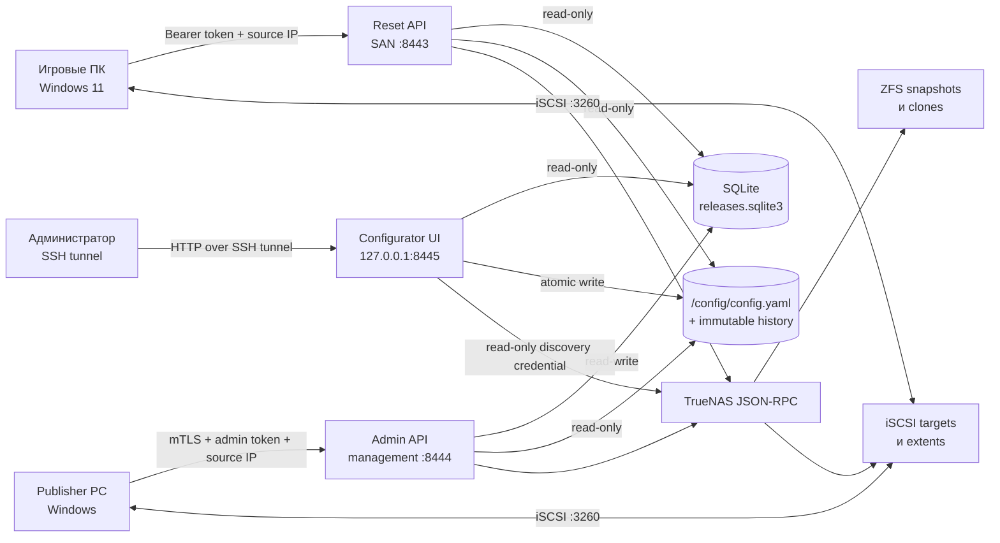
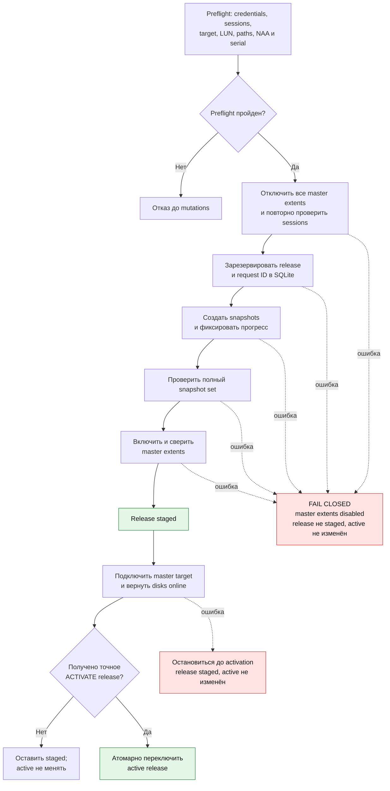
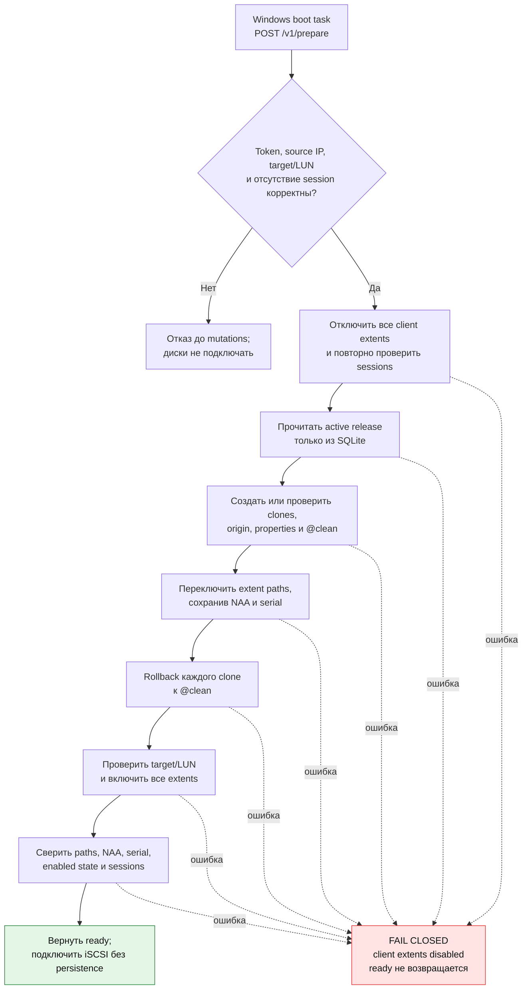

# iSCSI Reset Service v0.3.0

Fail-closed комплект для TrueNAS SCALE 25.10 и Windows 11:

- при загрузке игрового ПК откатывает его writable ZFS-клоны к `@clean`;
- лениво переключает клиент на текущий active release;
- публикует согласованный набор master snapshots через отдельный management API;
- даёт loopback-only GUI для безопасного выбора существующей TrueNAS topology;
- не сообщает игровому Windows-клиенту release name или ZFS paths.

Инструкции для следующих coding-агентов, включая обязательные safety-инварианты и матрицу
проверок, находятся в [AGENTS.md](AGENTS.md).

## Как это работает

### Компоненты



### Публикация release



### Сброс клиента



## Сеть и компоненты

| Назначение | Адрес |
|---|---|
| iSCSI portal | `10.20.40.10:3260` |
| Reset API для игровых ПК | `https://10.20.40.10:8443` |
| Release admin API | `https://<TRUENAS_MANAGEMENT_IP>:8444` |
| Configurator через SSH tunnel | `http://127.0.0.1:8445` |

Custom App запускает три одинаково ограниченных контейнера из одного image digest. Reset API
читает SQLite read-only; admin API изменяет её; configurator читает SQLite read-only и один
имеет write-доступ к каталогу `/config`. Admin API не слушает SAN IP и требует одновременно:

- сертификат клиента, выданный отдельным local CA;
- отдельный Bearer admin token;
- точный management IP Publisher PC из YAML.

Все три контейнера работают как `10001:10001`, с read-only root filesystem, `cap_drop: ALL`, без
privileged, Docker socket и `/dev/zvol`.

## Как volumes связываются между собой

`ssd` и `hdd` — произвольные ключи, а не встроенные типы. Один ключ связывает:

```text
publisher.volumes.ssd.dataset
        ↓ snapshot текущего release
SQLite: release → snapshots.ssd
        ↓ clone
clients.<client>.volumes.ssd → extent ID/LUN/drive letter
```

Клиент может использовать подмножество publisher volumes. Для каждого используемого volume
`clone_parent` обязан находиться в том же ZFS pool, что и master dataset.

Пример путей для `games-2026.08.18.2`:

```text
nvme/masters/games-ssd@games-2026.08.18.2
nvme/clients/chimera/ssd__games-2026.08.18.2
nvme/clients/chimera/ssd__games-2026.08.18.2@clean
```

## Конфигурация v2 и SQLite

YAML содержит только статическую topology. Releases и active pointer находятся в
`/state/releases.sqlite3`. Предпочтительный путь настройки — configurator: он предлагает portal,
target, extent, LUN, master dataset и clone parent только из актуального read-only discovery,
а затем повторно сверяет TrueNAS, schema v2 и SQLite перед записью. Ручной путь остаётся доступен:
скопируйте `config/config.example.yaml` и замените IP, IQN, extent ID, LUN и token digests.

Проверка:

```bash
iscsi-reset-service config validate --path /config/config.yaml
```

Сервис генерирует имена `games-YYYY.MM.DD.N` в настроенной timezone. До публикации и активации
первого release reset `/readyz` возвращает `503`. Старые releases, snapshots и clones не
удаляются автоматически.

Configurator и структурные формы используют одну draft-модель. Advanced YAML разбирается
safe-loader с запретом duplicate keys и после проверки сериализуется канонически: комментарии и
исходное форматирование не сохраняются. Сохранение использует `base_revision`, файловый lock,
immutable copy в `/config/history`, `fsync`, mode `0600` и атомарный `os.replace`. Hot reload и
автоматический redeploy отсутствуют: после записи нужно перезапустить весь Custom App.

Формат v1 намеренно не импортируется автоматически. Пошаговое преобразование описано в
`MIGRATION-v1-v2.md`.

## Подготовка TrueNAS

1. Создать master zvol для каждого `publisher.volumes.<name>.dataset`.
2. Создать один publisher target с отдельными постоянными extent records и LUN associations.
3. Ограничить publisher initiator group SAN IP и IQN Publisher PC.
4. Создать отдельный target и initiator group для каждого игрового ПК.
5. Создать постоянный extent для каждого клиентского LUN. Сервис меняет только `disk` и
   `enabled`, сохраняя extent NAA и serial.
6. Исключить `*/clients/*` из periodic snapshot tasks.
7. Создать runtime API-пользователя без root. Нужны чтение iSCSI sessions/targets/extents,
   `SHARING_ISCSI_EXTENT_WRITE`, чтение datasets/snapshots, `SNAPSHOT_WRITE`, clone и rollback.
8. Создать отдельного discovery API-пользователя для configurator. Ему нужны только
   `DATASET_READ`, `SHARING_ISCSI_GLOBAL_READ`, `SHARING_ISCSI_PORTAL_READ`,
   `SHARING_ISCSI_TARGET_READ`, `SHARING_ISCSI_EXTENT_READ`,
   `SHARING_ISCSI_TARGETEXTENT_READ` и `SHARING_ISCSI_INITIATOR_READ`; write-роли не выдавать.
9. Создать dataset `/mnt/tank/iscsi-reset/state`, выдать `10001:10001` write-доступ. Его следует
   резервно копировать; клиентские clone datasets в этот backup не включать.
10. Создать каталог `/mnt/tank/iscsi-reset/config`, положить в него `config.yaml`, выдать каталог
    `10001:10001`, а файлу mode `0600`. Reset/admin монтируют каталог read-only, configurator —
    read-write. Старый mount одного файла нужно преобразовать по `MIGRATION-v1-v2.md`.
11. Создать отдельные high-entropy файлы `token_pepper`, `admin_token_pepper`, configurator
    token digest, runtime API key и read-only discovery API key.
12. Выпустить reset server certificate, admin server certificate и отдельный admin client PFX.
    Admin server certificate должен содержать management IP TrueNAS, а client certificate —
    Extended Key Usage `Client Authentication`.

TrueNAS API соединение внутри host networking использует `wss://127.0.0.1/api/current`.
Отключение его TLS-проверки разрешено только вместе с
`TRUENAS_TLS_INSECURE_ACK=I_ACCEPT_MITM_RISK`.

## Токены и Custom App

Сгенерировать client/admin tokens можно до установки:

```bash
iscsi-reset-service token generate chimera \
  --config /config/config.yaml --pepper-file /run/secrets/token_pepper

iscsi-reset-service admin-token generate \
  --pepper-file /run/secrets/admin_token_pepper

iscsi-reset-service configurator-token generate \
  --pepper-file /run/secrets/admin_token_pepper
```

Raw token показывается один раз. В YAML помещается только `token_digest`; configurator login
digest хранится отдельным secret-файлом. GUI также умеет генерировать client/admin token:
raw-значение показывается один раз, не пишется в config, логи, audit или browser storage.

Универсальный шаблон `truenas/custom-app.yaml` требует заменить:

- GHCR image и immutable digest;
- `/mnt/tank/...` paths;
- `REPLACE_WITH_TRUENAS_MANAGEMENT_IP`;
- TLS/secrets filenames.

Для опубликованной версии удобнее скачать готовый release bundle: в нём все три службы уже
ссылаются на один публичный образ по immutable digest, поэтому GHCR credentials не нужны.

```bash
gh release download v0.3.0 \
  --pattern 'iscsi-reset-service-v0.3.0-truenas.yaml' \
  --pattern 'image-digest.txt' \
  --pattern 'SHA256SUMS'
sha256sum --check SHA256SUMS
```

В release YAML остаётся заменить только настройки конкретного TrueNAS: management IP,
`/mnt/tank/...` paths и при необходимости имена TLS/secrets файлов. Image tag менять нельзя:
все три службы намеренно закреплены на одном `sha256` digest.

Установить через **Apps → Discover Apps → Custom App → Install via YAML**. После запуска:

```bash
curl --cacert reset-ca.crt https://10.20.40.10:8443/healthz

curl --cacert admin-ca.crt \
  --cert publisher-client.crt --key publisher-client.key \
  https://<TRUENAS_MANAGEMENT_IP>:8444/healthz
```

Admin `/readyz` должен вернуть `ready`. Reset `/readyz` станет ready после первого activate.

Открыть configurator с административного компьютера:

```bash
ssh -N -L 8445:127.0.0.1:8445 <truenas>
```

Затем перейти на `http://127.0.0.1:8445`. Сервер проверяет loopback client/Host/Origin,
использует отдельную session cookie (`HttpOnly`, `SameSite=Strict`), CSRF token, 30 минут idle и
8 часов maximum lifetime. Assets встроены в image; внешних CDN нет. После сохранения GUI
показывает saved/startup revisions и требует штатный restart всего Custom App.

## Установка на Publisher PC

Запустить elevated Windows PowerShell 5.1:

```powershell
$pfxPassword = Read-Host -AsSecureString "Client PFX password"
.\Install-IscsiReleasePublisher.ps1 `
  -ApiBaseUrl "https://<TRUENAS_MANAGEMENT_IP>:8444" `
  -AdminToken "<RAW_ADMIN_TOKEN>" `
  -CaCertificatePath ".\admin-ca.crt" `
  -ClientCertificatePfxPath ".\publisher-client.pfx" `
  -ClientCertificatePassword $pfxPassword
```

Installer импортирует CA и client certificate, а token/config сохраняет под
`C:\ProgramData\IscsiResetPublisher` с ACL только Administrators и SYSTEM.

Для публикации master target должен быть подключён к Publisher PC:

```powershell
C:\ProgramData\IscsiResetPublisher\Publish-IscsiRelease.ps1
```

Скрипт сначала сопоставляет полный набор master-дисков по NAA, переводит только их offline,
отключает target, сохраняет idempotency request ID и вызывает `stage`. После успешного `stage`
он сразу подключает master target и возвращает диски online, а уже затем просит напечатать
точную строку `ACTIVATE <release>`. При отказе release остаётся staged, active pointer не
меняется, а master-диски продолжают работать. При ошибке `stage` target остаётся отключённым;
при ошибке reconnect activation не выполняется, и следующий запуск сначала повторяет reconnect.

Сценарий никогда не вызывает `Initialize-Disk`, `Format-Volume`, `Clear-Disk`, `New-Partition`
или изменение разделов.

## Установка reset-клиента

Контракт и установка игрового клиента не изменились:

```powershell
.\Install-IscsiResetClient.ps1 `
  -ClientToken "<RAW_CLIENT_TOKEN>" `
  -CaCertificatePath ".\reset-ca.crt"
```

Scheduled Task запускается от SYSTEM при старте. Клиент получает только portal, свой target и
список `{lun, disk_unique_id, drive_letter, label}`. Login всегда `IsPersistent=false`; при
ошибке после подключения созданная сессия отключается.

## Fail-closed публикация

`POST /v1/admin/releases/stage`:

1. проверяет publisher session, target/LUN, extent path, NAA и serial;
2. выключает все master extents и повторно проверяет отсутствие session;
3. резервирует release и request ID в SQLite;
4. создаёт snapshots `recursive=false`, записывая прогресс после каждого;
5. проверяет полный набор, включает extents и сверяет invariants;
6. только после этого возвращает `staged`.

Частичная ошибка оставляет master extents выключенными и старый active release неизменным.
Повтор с тем же request ID продолжает incomplete release. Другой request ID получает
`409 RELEASE_INCOMPLETE`.

Activation требует JSON:

```json
{"confirmation":"ACTIVATE games-2026.08.18.2"}
```

Она одной SQLite-транзакцией меняет active pointer. Redeploy App не нужен.

## API

Reset API:

- `GET /healthz`, `GET /readyz`;
- `GET /v1/client`;
- `POST /v1/validate`;
- `POST /v1/prepare`.

Admin API:

- `GET /healthz`, `GET /readyz`;
- `GET /v1/admin/publisher`;
- `GET /v1/admin/releases`;
- `POST /v1/admin/releases/validate`;
- `POST /v1/admin/releases/stage`;
- `POST /v1/admin/releases/{release}/activate`.

Configurator API (только `127.0.0.1:8445`):

- `POST/DELETE /v1/configurator/session`;
- `GET /v1/configurator/status`, `/discovery`, `/config`;
- `POST /v1/configurator/config/validate`;
- `PUT /v1/configurator/config`;
- `POST /v1/configurator/tokens`.

Основные ошибки: `401`, `403 SOURCE_IP_MISMATCH`, `409 SESSION_ACTIVE` или release conflict,
`423 CLIENT_BUSY/RELEASE_BUSY`, `503 NOT_READY`.

## Проверка

```bash
python -m pip install -e '.[test]'
ruff check src tests
pytest -q
docker compose up --build --abort-on-container-exit --exit-code-from windows-simulation
docker compose down --volumes
```

На Windows PowerShell 5.1:

```powershell
Invoke-Pester .\powershell\tests -Output Detailed -CI
```

Результат локальной проверки записан в `VERIFICATION.md`. Реальные destructive проверки
сначала выполнять только по `TEST-PLAN.md` на отдельных тестовых zvol.

## Выпуск версии

Обычный CI и release workflow используют один полный gate: Python/Ruff, Pester на Windows
PowerShell 5.1 и Compose interaction suite. Публикация запускается тегом, который обязан точно
соответствовать версии в `pyproject.toml`, например `v0.3.0`.

После успешных проверок workflow публикует только точный version tag
`ghcr.io/xerz/iscsi-reset-service:v0.3.0`, фиксирует фактический digest, добавляет SBOM и
provenance attestation и создаёт GitHub Release. Mutable tag `latest` не создаётся. В release
прикладываются TrueNAS YAML, полная digest-ссылка и `SHA256SUMS`; реальный TrueNAS автоматически
не изменяется.

Backend соответствует TrueNAS 25.10 API: [sessions](https://api.truenas.com/v25.10/api_methods_iscsi.global.sessions.html),
[datasets](https://api.truenas.com/v25.10/api_methods_pool.dataset.query.html),
[targets](https://api.truenas.com/v25.10/api_methods_iscsi.target.query.html),
[extents](https://api.truenas.com/v25.10/api_methods_iscsi.extent.query.html),
[associations](https://api.truenas.com/v25.10/api_methods_iscsi.targetextent.query.html),
[initiators](https://api.truenas.com/v25.10/api_methods_iscsi.initiator.query.html),
[portals](https://api.truenas.com/v25.10/api_methods_iscsi.portal.query.html),
[snapshot create](https://api.truenas.com/v25.10/api_methods_pool.snapshot.create.html),
[snapshot clone](https://api.truenas.com/v25.10/api_methods_pool.snapshot.clone.html),
[rollback](https://api.truenas.com/v25.10/api_methods_pool.snapshot.rollback.html) и
[extent update](https://api.truenas.com/v25.10/api_methods_iscsi.extent.update.html).
